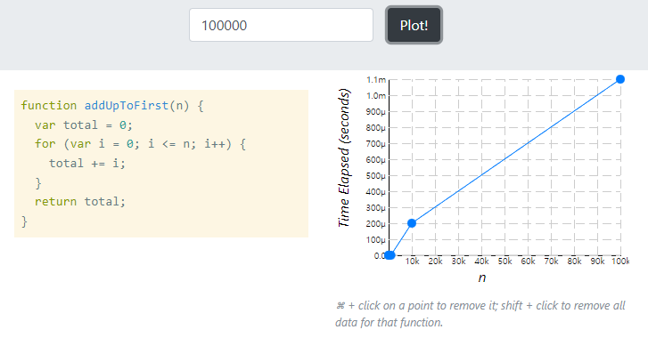

[TOC]

# 빅오 소개

빅오는 알고리즘의 성능을 나타내는 척도다.


# 코드 시간 재기

(JS 파일 참고)

```javascript
function addUpTo(n) {
  return n * (n + 1) / 2;
}

// 이 함수를 사용하지 않고도 알고리즘의 성능을 측정할 수 있는 것이 빅오 표기법이다.
let t1 = performance.now();
console.log('addUpTo(100000000) >>>', addUpTo(100000000))
let t2 = performance.now();
console.log(`Time Elapsed: ${(t2 - t1) / 1000} seconds.`)
```


# 연산 갯수 세기

- 아래 함수는 n에 따라서 연산의 횟수가 늘어난다. (5n + 2)

```javascript
function addUpTo(n) {
  let total = 0;
  for (let i = 1; i <= n; i++) {
    total += i;
  }
  return total;
}
```

- 위 함수는 n과 관계 없이 세 번의 연산을 한다.

```javascript
function addUpTo(n) {
  return n * (n + 1) / 2;
}
```

 

# 시간 복잡도 시각화하기

[Performance Tracker 사용](https://rithmschool.github.io/function-timer-demo/)

- 위에서 수동으로 `performance.now()`를 두 번 기록했던 것을 그래프로 볼 수 있다.
- 10부터 순차적으로 10 씩 곱해가며 실행해본다.

## 1. 빠른 버전



- 숫자가 늘어나면서 그래프가 가파르게 상승하지만, 단위가 마이크로 초이기 때문에 성능에 거의 차이가 없다.


## 2. 느린 버전


# 빅오에 대한 공식 소개


# 빅오 표현식의 단순화하기


# 퀴즈 1: 빅오 시간 복잡도 퀴즈


# 퀴즈 2: 빅오 시간 복잡도 퀴즈 2


# 공간 복잡도


# 퀴즈 3: 빅오 공간 복잡도 퀴즈


# 로그와 섹션 요약