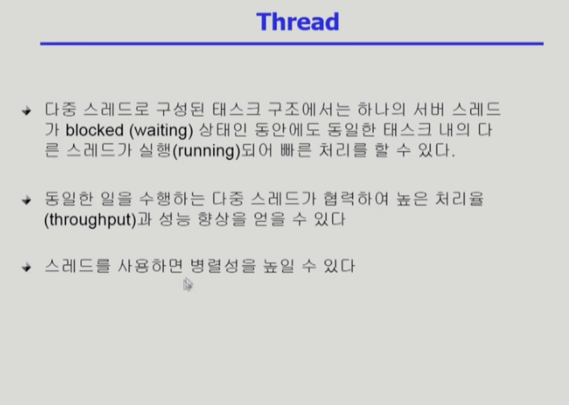
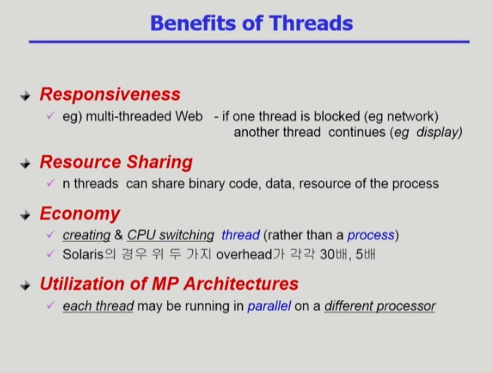
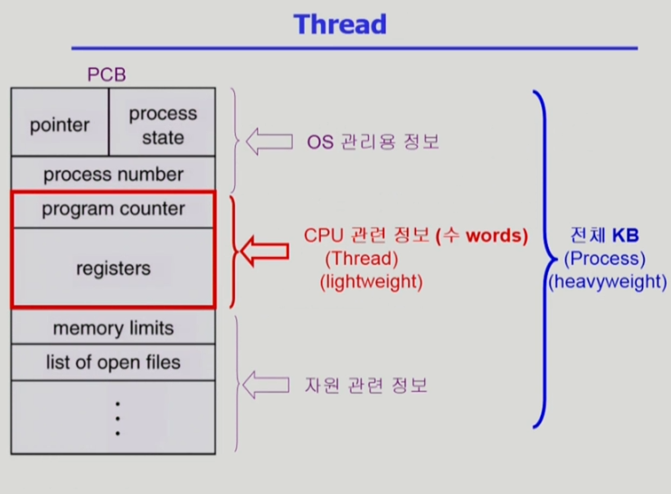
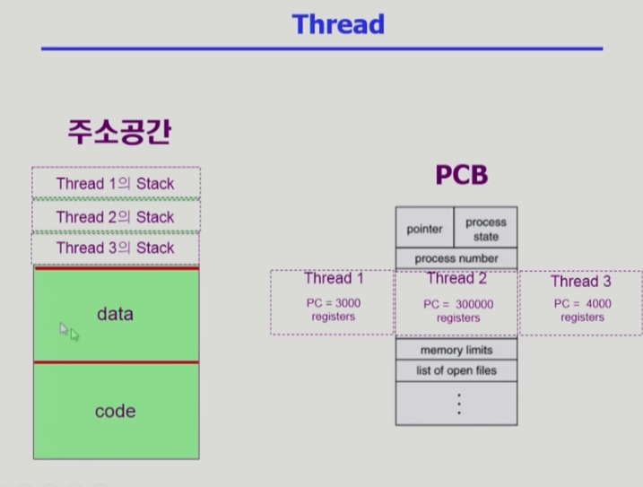
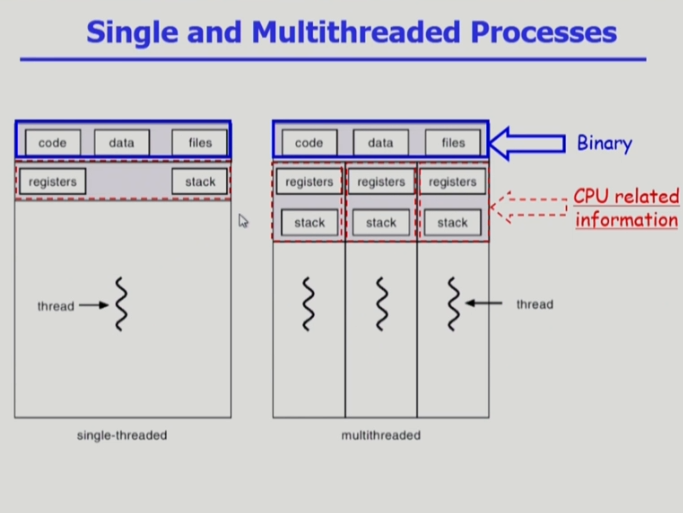
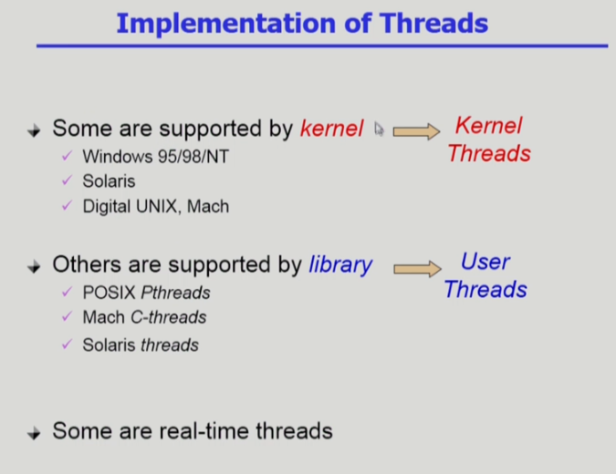

# 06_Process_3

### 스레드 사용의 장점

- 빠른 응답성
- 자원을 절약: 같은 일을 하는 프로세스를 여러 개 띄워 놓게 되면 메모리 낭비가 일어나는데, 그렇게 하지 않고 하나의 프로세스 안에어 스레드만 여러 개로 나누어 놓는 것이다.

- 프로세스마다 하나의 PCB가 만들어지는데, 이 안에 스레드가 여러개 있게 되면, CPU 수행과 관련된 정보만 스레드마다 별도로 가지고 있게 된다.

- PCB에서 독자적으로 가질 만한 정보들(카운터, 레지스터. 스택 부분)만 스레드들이 개별적으로 가지고 있다

### 스레드의 구현 방식

- kernel threads: 커널이 스레드의 존재를 알고 있음
- user threads: 