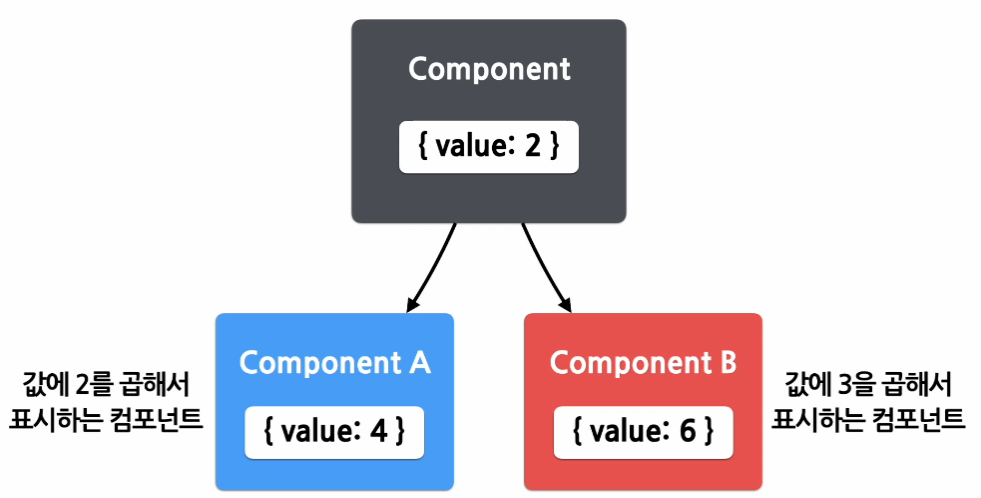
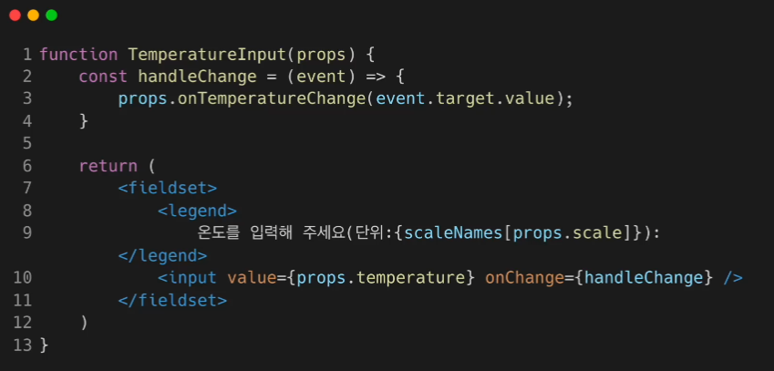
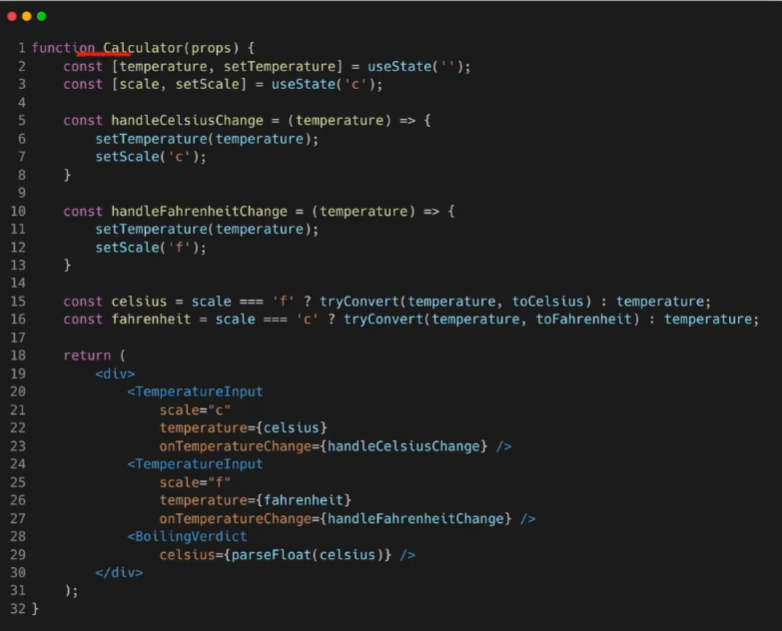
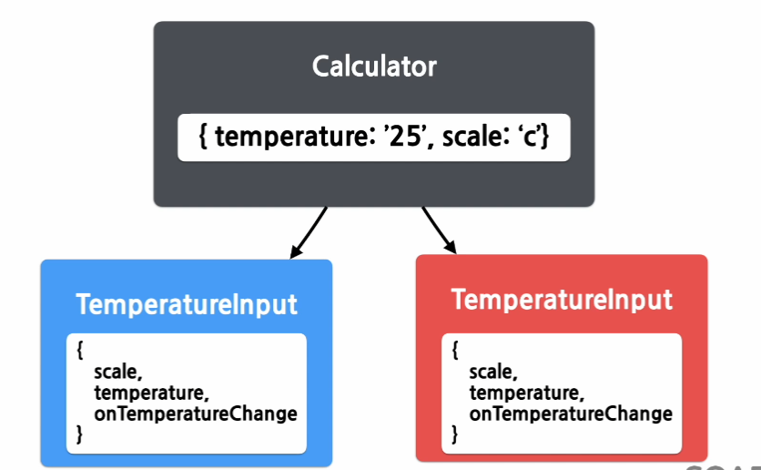

# Shared State

데이터를 여러 개의 컴포넌트에 표현해야 할 때, 각 자식 컴포넌트들에 모두 저장하는 것이 아니라, 가장 가까운 공통의 부모 컴포넌트에만 저장하면 된다.




## 하위 컴포넌트에서 State 공유하기

사용자로부터 온도를 입력받고, 화씨와 섭씨로 변환하고, 물이 끓는지 여부를 알려주는 컴포넌트 구성하기


#### 1. 물의 끓음 여부를 알려주는 컴포넌트

```react
function BoilingVerdict(props) {
    if (props.celsius >= 100) {
        return <p>물이 끓습니다.</p>;
    }
    return <p>물이 끓지 않습니다.</p>;
}
```


#### 2. 부모 컴포넌트

```react
function Calculator(props) {
    const [temperature, setTemprature] = useState('');
    
    const handleChange = (event) => {
        setTemperature(event.target.value);
    }
    
    return (
        <fieldset>
            <legend>섭씨 온도를 입력하세요:</legend>
            <input
                value={temperature}
                onChange={handleChange} />
            <BoilingVerdict
                celsius={parseFloat(temperature)} />
        </fieldset>
    )
}
```


#### 3. 입력 컴포넌트 추출하기(섭씨, 화씨에 각각 이용하기 위해 재사용)

```react
const scaleNames = {
    c: '섭씨',
    f: '화씨'
};

function TemperatureInput(props) {
    const [temperature, setTemperature] = useState('');
    
    const handleChange = (event) => {
        setTemperature(event.target.value);
    }
    
    return (
        <fieldset>
            <legend>
                온도를 입력해 주세요(단위:{scaleNames[props.scale]}):
            </legend>
            <input value={temperature} onChange={handleChange} />
        </fieldset>
    )
}
```


#### 4. Calculator 컴포넌트를 변경

```react
function Calculator(props) {
    return (
        <div>
            <TemperatureInput scale="c" />
            <TemperatureInput scale="f" />
        </div>
    )
}
```


#### 5. 온도 변환 함수 작성하기

```react
function toCelsius(fahrenheit) {
    return (fahrenheit - 32) * 5 / 9;
}

function toFahrenheit(celsius) {
    return (celsius * 9 / 5) + 32;
}
```

```react
function tryConvert(temperature, convert) {
    const input = parseFloat(temperature);
    if (Number.isNaN(input)) {
        return '';
    }
    const output = convert(input);
    const rounded = Math.round(output * 1000) / 1000;
    return rounded.toString();
}
```


#### 6.  Shared State 적용하기

하위 스테이트를 공통 상위 컴포넌트로 lift한다.

```react
//TemperatureInput 함수 수정

return (
    ...
    <input value={props.temperature} onChange={handleChange} />
    ...
)
```

```react
// handleChange 수정

const handleChange = (event) => {
    props.onTemperatureChange(event.target.value);
}
```


#### 7. 완성된 TemperatureInput 함수




#### 8. Calculator 컴포넌트 변경



