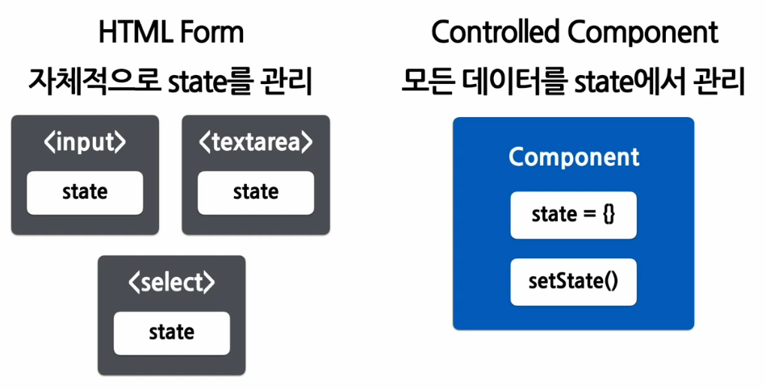
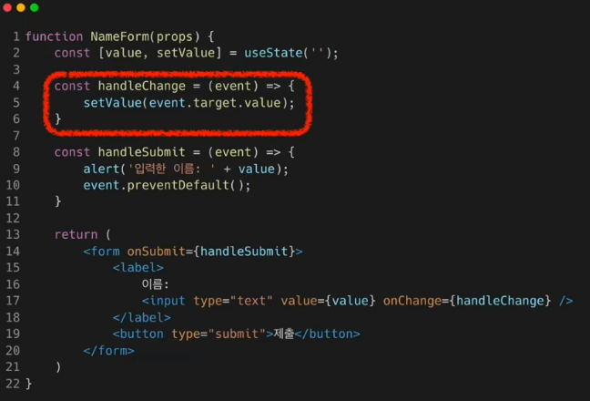
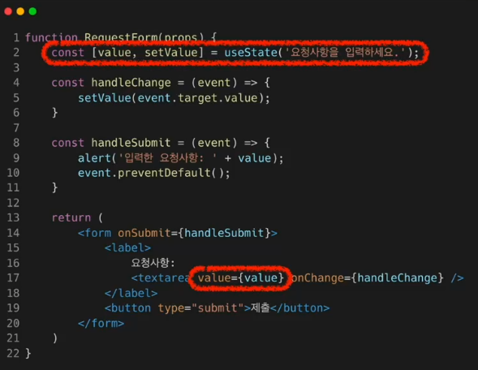
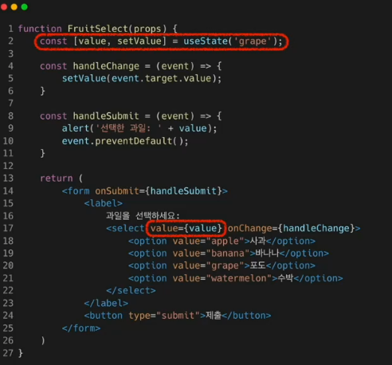
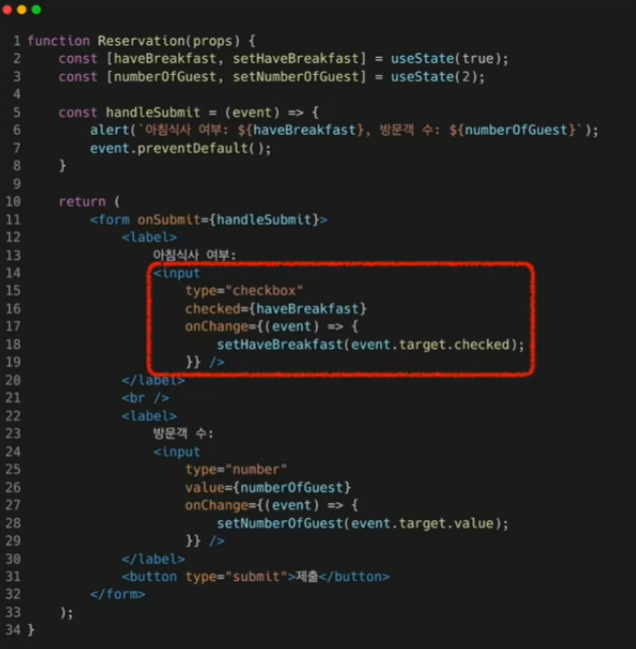
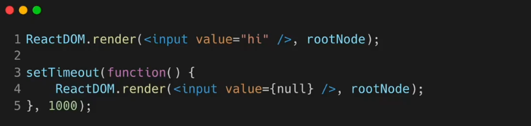

# Forms

_사용자로부터 입력을 받기 위해 사용_


## Controlled Component

값이 React의 통제를 받는 Input Form element





-> 사용자의 입력을 직접적으로 제어할 수 있게 된다.


예)

```react
const handleChange = (event) => {
    setValue(event.target.value.toUpperCase());
}
```


## 다양한 Forms

### 1. textarea



- 초기값이 설정되어 있다.


### 2. Select

drop down 목록을 보여주기 위한 HTML 태그




### 3. file input

- 디바이스의 저장 장치로부터 하나 또는 여러 개의 파일을 선택할 수 있게 해주는 HTML 태그
- 서버로 파일을 업로드하거나, JS의 file API를 이용할 때 사용한다. 
- uncontrolled component: 값이 React의 통제를 받지 않는다.

```react
<input type="file" />
```


## Multiple Inputs

하나의 컴포넌트에서 여러 개의 input을 다루는 법은?

-> 여러 개의 state를 선언하여 각각의 입력에 대해 사용




## Input Null Value

React component의 value를 prop으로 주면, value를 수정할 수 없다. 만약 자유롭게 입력하게 만들고 싶다면 값에 undefined 또는 null을 넣어주면 된다.

#### 일정 시간이 지난 후 자유롭게 input value를 입력할 수 있는 코드

