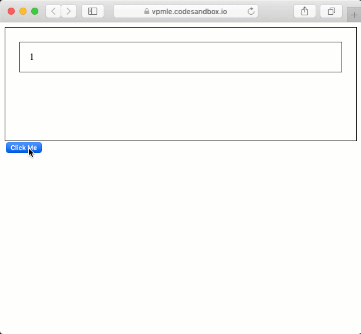
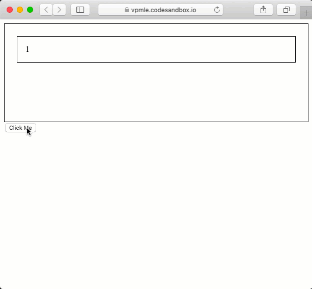

## State

- 주로 class component에서 사용되기 때문에 개념만 정립하면 된다.

### 1. State 란?

> 리액트를 다루는 핵심 !

`State`는 `props`처럼 `App` 컴포넌트의 렌더링 결과물에 영향을 주는 데이터를 갖고 있는 객체지만,

`props`는 (함수 매개변수처럼) 컴포넌트*에* 전달되는 반면 `state`는 (함수 내에 선언된 변수처럼) **컴포넌트 \*안에서\* 관리**된다는 차이가 있다.

props를 사용했는데도 state를 사용하는 이유는, **사용하는 쪽과 구현하는 쪽을 철저하게 분리시켜서 양쪽의 편의성을 각자 도모**하는 것에 있다.


### 2. 사용하기

`State `객체를 사용하고 싶다면 컴포넌트를 생성할 때 가장 윗부분(`render()` 함수보다 먼저)에 `constructor()` 함수를 적어준다. 컴포넌트 생성자에서 `super`를 호줄하기 전에는 `this`를 사용할 수 없기 때문이다.

```js
class App extends Component {
  constructor(props) {
    super(props);
      this.state={
      Subject:{title:'WEB',sub:'월드와이드웹!'}
    }
  }
  render() {
    return (
      	<div className="App">
        <Subject 
        	title={this.state.subject.title} 
    		sub={this.state.subject.sub}>
        </Subject>
      </div>
    );
  }
}
```

즉, 컴포넌트의 시작 부분에서 `constructor()` 라는 함수가 **컴포넌트의 초기화**를 시켜줘야 `State` 에 값을 넣어 사용할 수 있는 것이다.

그리고 App 클래스 내부에서는 **중괄호**를 이용해

```js
title={this.state.subject.title} 
```

와 같이 `State`값을 가져와 사용한다.


### 3. State와 Props의 차이점

```js
class App extends Component {
  render() {
    return (
      <div className="App">
        <Subject title="WEB" sub="월드와이드웹!"></Subject>
      </div>
    );
  }
}
```

위 코드는 `State`를 사용해 수정하기 전, 즉 `Props`만 사용했을 때 `App` 컴포넌트의 모습이다.

화면에 출력되는 내용은 완전히 똑같지만, `props` 데이터를 사용자에게 노출되는 부분에 직접 적는 것이 아니라 `State`를 통해 참조했다는 차이가 있다. 즉,

사용자가 알 필요가 없는 데이터를 내부에서 은닉하는 것. 즉, **`캡슐화`를 통해 코드를 리펙토링 하는 것이 좋은 사용성을 만드는 핵심**이다.


## React Lifecycle

생명주기 메서드 역시 클래스형 컴포넌트에서만 사용할 수 있다.

> https://react.vlpt.us/basic/25-lifecycle.html

### 마운트

- constructor
- getDerivedStateFromProps
- render
- componentDidMount

#### constructor

`constructor` 는 컴포넌트의 생성자 메서드입니다. 컴포넌트가 만들어지면 가장 먼저 실행되는 메서드입니다.

```javascript
  constructor(props) {
    super(props);
    console.log("constructor");
  }
```

#### getDerivedStateFromProps

`getDerivedStateFromProps` 는 `props` 로 받아온 것을 `state` 에 넣어주고 싶을 때 사용합니다.

```javascript
  static getDerivedStateFromProps(nextProps, prevState) {
    console.log("getDerivedStateFromProps");
    if (nextProps.color !== prevState.color) {
      return { color: nextProps.color };
    }
    return null;
  }
```

다른 생명주기 메서드와는 달리 앞에 `static` 을 필요로 하고, 이 안에서는 `this` 롤 조회 할 수 없습니다. 여기서 특정 객체를 반환하게 되면 해당 객체 안에 있는 내용들이 컴포넌트의 `state` 로 설정이 됩니다. 반면 `null` 을 반환하게 되면 아무 일도 발생하지 않습니다.

참고로 이 메서드는 컴포넌트가 처음 렌더링 되기 전에도 호출 되고, 그 이후 리렌더링 되기 전에도 매번 실행됩니다.

#### render

컴포넌트를 렌더링하는 메서드입니다. 이미 익숙하죠? :)

#### componentDidMount

컴포넌트의 첫번째 렌더링이 마치고 나면 호출되는 메서드입니다. 이 메서드가 호출되는 시점에는 우리가 만든 컴포넌트가 화면에 나타난 상태입니다. 여기선 주로 D3, masonry 처럼 DOM 을 사용해야하는 외부 라이브러리 연동을 하거나, 해당 컴포넌트에서 필요로하는 데이터를 요청하기 위해 axios, fetch 등을 통하여 ajax 요청을 하거나, DOM 의 속성을 읽거나 직접 변경하는 작업을 진행합니다.


### 업데이트

이번에는 컴포넌트가 업데이트 되는 시점에 어떤 생명주기 메서드들이 호출되는지 알아봅시다.

- getDerivedStateFromProps
- shouldComponentUpdate
- render
- getSnapshotBeforeUpdate
- componentDidUpdate

#### getDerivedStateFromProps

아까전에 이미 다뤘던 메서드이지요? 컴포넌트의 props 나 state 가 바뀌었을때도 이 메서드가 호출됩니다. 잘 알아두세요!

#### shouldComponentUpdate

`shouldComponentUpdate` 메서드는 컴포넌트가 리렌더링 할지 말지를 결정하는 메서드입니다.

```javascript
  shouldComponentUpdate(nextProps, nextState) {
    console.log("shouldComponentUpdate", nextProps, nextState);
    // 숫자의 마지막 자리가 4면 리렌더링하지 않습니다
    return nextState.number % 10 !== 4;
  }
```

주로 최적화 할 때 사용하는 메서드입니다. 우리가 이전에 `React.memo` 를 배웠었지요? 그 역할과 비슷하다고 이해하시면 됩니다.

#### render

이미 알고있는 메서드지요? 생략하겠습니다!

#### getSnapshotBeforeUpdate

`getSnapshotBeforeUpdate` 는 컴포넌트에 변화가 일어나기 직전의 DOM 상태를 가져와서 특정 값을 반환하면 그 다음 발생하게 되는 `componentDidUpdate` 함수에서 받아와서 사용을 할 수 있습니다.

```javascript
  getSnapshotBeforeUpdate(prevProps, prevState) {
    console.log("getSnapshotBeforeUpdate");
    if (prevProps.color !== this.props.color) {
      return this.myRef.style.color;
    }
    return null;
  }
```

#### componentDidUpdate

`componentDidUpdate` 는 리렌더링이 마치고, 화면에 우리가 원하는 변화가 모두 반영되고 난 뒤 호출되는 메서드입니다. 3번째 파라미터로 `getSnapshotBeforeUpdate` 에서 반환한 값을 조회 할 수 있습니다.

```javascript
  componentDidUpdate(prevProps, prevState, snapshot) {
    console.log("componentDidUpdate", prevProps, prevState);
    if (snapshot) {
      console.log("업데이트 되기 직전 색상: ", snapshot);
    }
  }
```


```javascript
  getSnapshotBeforeUpdate(prevProps, prevState) {
    // DOM 업데이트가 일어나기 직전의 시점입니다.
    // 새 데이터가 상단에 추가되어도 스크롤바를 유지해보겠습니다.
    // scrollHeight 는 전 후를 비교해서 스크롤 위치를 설정하기 위함이고,
    // scrollTop 은, 이 기능이 크롬에 이미 구현이 되어있는데,
    // 이미 구현이 되어있다면 처리하지 않도록 하기 위함입니다.
    if (prevState.array !== this.state.array) {
      const { scrollTop, scrollHeight } = this.list;

      // 여기서 반환 하는 값은 componentDidMount 에서 snapshot 값으로 받아올 수 있습니다.
      return {
        scrollTop,
        scrollHeight
      };
    }
  }

  componentDidUpdate(prevProps, prevState, snapshot) {
    if (snapshot) {
      const { scrollTop } = this.list;
      if (scrollTop !== snapshot.scrollTop) return; // 기능이 이미 구현되어있다면 처리하지 않습니다.
      const diff = this.list.scrollHeight - snapshot.scrollHeight;
      this.list.scrollTop += diff;
    }
  }
```


Chrome 브라우저에서는 브라우저 자체적으로 이미 구현되어있는 기능중에 하나인데, 새로운 내용이 추가되었을 때 사용자의 스크롤 위치를 유지시키는 기능입니다. Safari 브라우저를 포함한 일부 브라우저는 이 기능이 구현되어있지 않아서 다음과 같이 작동하게 됩니다.



새로운 항목이 위에서 추가가 되면 사용자가 보는 구간이 한칸씩 계속 밀리게 되지요? `getSnapshotBeforeUpdate` 를 활용하면 다음과 같이 유지를 할 수 있습니다.



`getSnapshotBeforeUpdate` 는 사실 사용되는 일이 그렇게 많지 않습니다. 그냥 이런게 있다.. 정도만 알아두시면 충분합니다.

참고로 함수형 컴포넌트 + Hooks 를 사용 할 때에는 이 `getSnapshotBeforeUpdate` 를 대체 할 수 있는 기능이 아직 없습니다. DOM 에 변화가 반영되기 직전에 DOM 의 속성을 확인하고 싶을 때 이 생명주기 메서드를 사용하면 된다는 것을 알아두세요.


### 언마운트

언마운트라는것은, 컴포넌트가 화면에서 사라지는것을 의미합니다. 언마운트에 관련된 생명주기 메서드는 `componentWillUnmount` 하나입니다.

#### componentWillUnmount

`componentWillUnmount` 는 컴포넌트가 화면에서 사라지기 직전에 호출됩니다.

```javascript
  componentWillUnmount() {
    console.log("componentWillUnmount");
  }
```

여기서는 주로 DOM에 직접 등록했었던 이벤트를 제거하고, 만약에 `setTimeout` 을 걸은것이 있다면 `clearTimeout` 을 통하여 제거를 합니다. 추가적으로, 외부 라이브러리를 사용한게 있고 해당 라이브러리에 dispose 기능이 있다면 여기서 호출해주시면 됩니다.


### 정리

강의 초반에 봤던 이미지를 다시 한번 보면서 복습해봅시다.


출처: http://projects.wojtekmaj.pl/react-lifecycle-methods-diagram/

이전에 언급했듯이, 클래스형 컴포넌트를 쓰게 되는 일은 앞으로 많지 않을 것이므로, 그냥 이런게 있다 정도만 알아두시면 됩니다.

