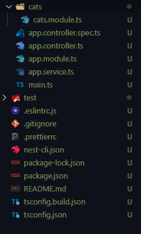
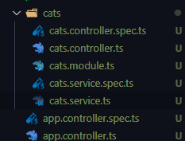

# Modules & 캡슐화

[TOC]

# Module

> express에서 만들었던 cats를 Next.js로 옮기기

**app.controller.ts**

```typescript
import { Controller, Get } from '@nestjs/common';
import { AppService } from './app.service';

@Controller()
export class AppController {
  constructor(private readonly appService: AppService) {}

  @Get('hello/:id')
  getHello() {
    return 'Hello World!';
  }
}
```

**app.service.ts**

```typescript
import { Injectable } from '@nestjs/common';

@Injectable()
export class AppService {
  getHello(): string {
    return 'Hello World!';
  }
}
```

## module 만들기

### 1. 명령어로 module 생성



```bash
$ nest g mo cats
```

**cats.module.ts**

```typescript
import { Module } from '@nestjs/common';

@Module({
  controllers: [],
  providers: [],
})
export class CatsModule {}
import { Module } from '@nestjs/common';

@Module({})
export class CatsModule {}
```

### 2. Controller 생성

```bash
$ nest g co cats
```

### 3. Service 생성

```bash
$ nest g service cats
```



## Controller에서 Service DI하고, Service에서 express에서 만들었던 API 구현하기

**cats.controller.ts**

```typescript
import { Controller, Get, Post, Put, Delete, Patch } from '@nestjs/common';
import { CatsService } from './cats.service';

@Controller('cats')
export class CatsController {
  constructor(private readonly catsService: CatsService) {}

  // cats/
  @Get()
  getAllCat() {
    return 'all cat';
  }

  // cats/:id
  @Get(':id')
  getOneCat() {
    return 'one cat';
  }

  @Post()
  createCat() {
    return 'create cat';
  }

  @Put(':id')
  updateCat() {
    return 'update cat';
  }

  @Patch(':id')
  updatePartialCat() {
    return 'update partial cat';
  }

  @Delete(':id')
  deleteCat() {
    return 'delete cat';
  }
}
```

### + users module도 만들기

```bash
$ nest go mo users
```

**app.module.ts**

```typescript
import { Module } from '@nestjs/common';
import { AppController } from './app.controller';
import { AppService } from './app.service';
import { CatsModule } from './cats/cats.module';
import { UsersModule } from './users/users.module';

@Module({
  imports: [CatsModule, UsersModule],
  controllers: [AppController],
  providers: [AppService],
})
export class AppModule {}
```

# 캡슐화

> [공식 문서]
>
> 모듈은 기본적으로 공급자를 캡슐화합니다. 즉, 현재 모듈의 직접 부분이 아니거나 가져온 모듈에서 내보내지 않은 공급자를 삽입할 수 없습니다. 
>
> 즉, export 하지 않은 공급자는 사용할 수 없다는 것이다.
>
> [캡슐화 (encapsulation)]
>
> 객체(object)의 속성과 행위(method)를 하나로 묶고, 구현된 일부를 감추어 은닉한다.

**cats.module.ts에서 CatsService를 export 해준다.**

```typescript
import { Module } from '@nestjs/common';
import { CatsController } from './cats.controller';
import { CatsService } from './cats.service';

@Module({
  controllers: [CatsController],
  providers: [CatsService],
  exports: [CatsService],
})
export class CatsModule {}
```

**비로소 app.controller.ts에서 CatsService를 사용할 수 있게 된다.**

```typescript
import { Controller, Get } from '@nestjs/common';
import { AppService } from './app.service';
import { CatsService } from './cats/cats.service';

@Controller()
export class AppController {
  constructor(
    private readonly appService: AppService,
    private readonly catsService: CatsService,
  ) {}

  @Get('hello/:id')
  getHello() {
    return 'Hello World!';
  }
}
```