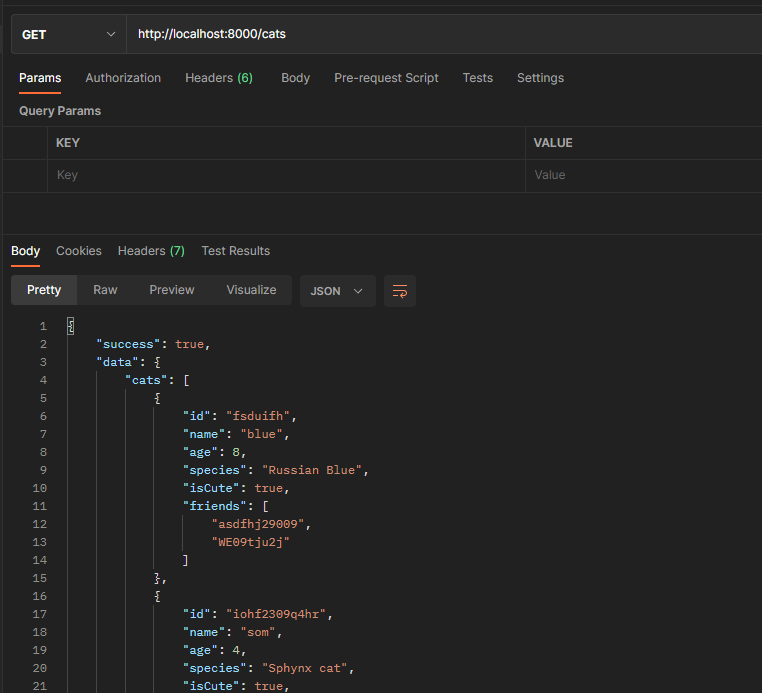
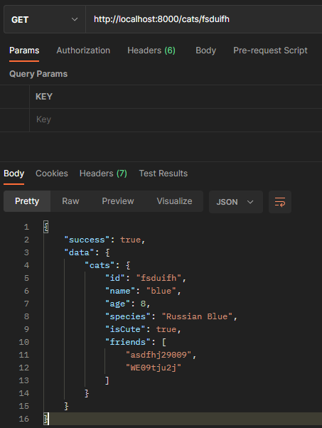
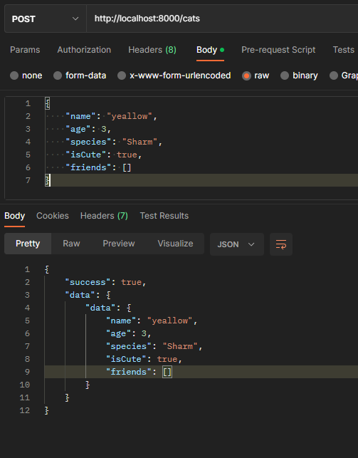

# 고양이 데이터 Create Read API 개발

[TOC]

## READ 고양이 전체 데이터

```typescript
// * logging middleware
app.use((req, res, next) => {
  console.log(req.rawHeaders[1])
  console.log("this is logging middleware")
  next()
})

// * READ 고양이 전체 데이터 다 조회
app.get('/cats', (req, res) => {
  try {
    const cats = Cat;
    // throw new Error('db connect error');
    res.status(200).send({
      success: true,
      data: {
        cats,
      },
    });
  } catch (error: any) {
    res.status(400).send({
      success: false,
      error: error.message,
    })
  }
})

// * 404 error middleware
app.use((req, res, next) => {
  console.log('this is logging middleware')
  res.send({error: "404 not found error"})
  next()
})

// listen(): 서버를 실행하는 메서드
// app.listen(port, () => console.log(`Example app listening on port http://localhost:${port}`))
app.listen(8000, () => {
  console.log('server is on...')
})
```




## READ 특정 고양이 데이터

```typescript
// * READ 특정 고양이 데이터 조회
app.get('/cats/:id', (req, res) => {
  try {
    const params = req.params;
    const cats = Cat.find((cat) => {
      return cat.id === params.id;
    });
    // status(): status 코드를 넣어 준다.
    res.status(200).send({
      success: true,
      data: {
        cats,
      },
    });
  } catch (error: any) {
    res.status(400).send({
      success: false,
      error: error.message,
    })
  }
})
```



## CREATE 고양이 데이터

> express에서 JSON을 읽을 수 있도록 middleware를 추가해야 한다.

### JSON middleware

```typescript
// * JSON parsing middleware
app.use(express.json())
```

### POST 함수

```typescript
// * CREATE 새로운 고양이 추가
app.post('/cats', (req, res) => {
  try {
    const data = req.body;
    Cat.push(data)
    res.status(200).send({
      success: true,
      data: {data},
    });
  } catch (error: any) {
    res.status(400).send({
      success: false,
      error: error.message,
    })
  }
})
```


