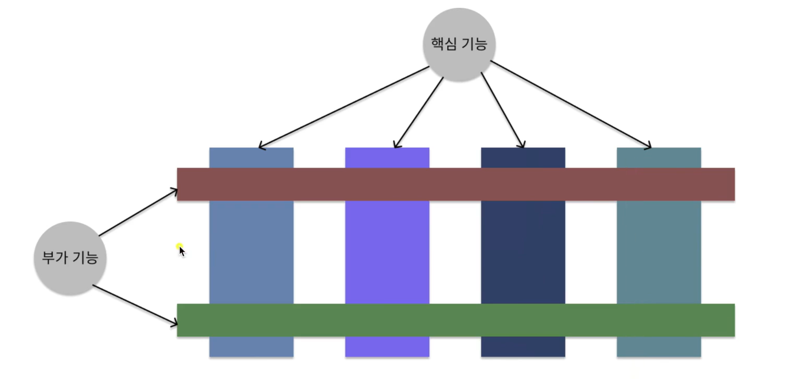
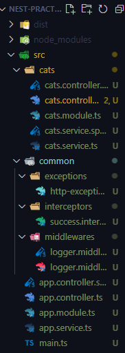
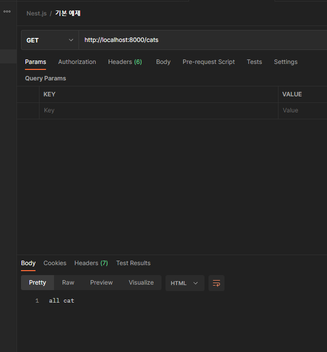
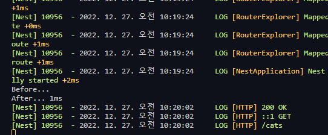

# Interceptors & AOP 패턴

[TOC]

# Interceptor 

> `@Injectable()` 데코레이터로 주석이 달린 클래스.` NestInterceptor` 인터페이스를 구현해야 한다. DI가 가능하다. AOP로부터 영감을 받아 만들어졌다.


# AOP(관점 지향 프로그래밍, Aspect Oriented Programming)

> cross-cutting concern(횡단 관심사) 모듈성을 증가시키는 것이 목적인 프로그래밍 패러다임



여러 개의 컨트롤러(세로 기둥)들이 모두 Logging 기능을 사용한다면 하나의 모듈로 묶었던 것을 생각하면 된다.


# 실습

## common 폴더 만들기



## `success.interceptor.ts`

```typescript
import { Injectable, NestInterceptor, ExecutionContext, CallHandler } from '@nestjs/common';
import { Observable } from 'rxjs';
import { tap } from 'rxjs/operators';

@Injectable()
export class SuccessInterceptor implements NestInterceptor {
  intercept(context: ExecutionContext, next: CallHandler): Observable<any> {
    console.log('Before...');

    const now = Date.now();
    return next
      .handle()
      .pipe(
        tap(() => console.log(`After... ${Date.now() - now}ms`)),
      );
  }
}
```

## `cats.controller.ts` 에 의존성 주입 후 테스트

```typescript
import {
  Param,
  Controller,
  Get,
  Post,
  Put,
  Delete,
  Patch,
  UseFilters,
  UseInterceptors,
} from '@nestjs/common';
// import { HttpException } from '@nestjs/common/exceptions';
import { CatsService } from './cats.service';
import { HttpExceptionFilter } from 'src/common/exceptions/http-exception.filter';
import { ParseIntPipe } from '@nestjs/common/pipes';
import { SuccessInterceptor } from 'src/common/interceptors/success.interceptor';

@Controller('cats')
@UseInterceptors(SuccessInterceptor)
@UseFilters(HttpExceptionFilter)
export class CatsController {
  constructor(private readonly catsService: CatsService) {}

  // cats/
  @Get()
  getAllCat() {
    return 'all cat';
  }
...
```





### Nest.js Lifecycle

1. Incoming request
2. Globally bound middleware
3. Module bound middleware
4. Global guards
5. Controller guards
6. Route guards
7. Global interceptors (pre-controller)
8. Controller interceptors (pre-controller)
9. Route interceptors (pre-controller)
10. Global pipes
11. Controller pipes
12. Route pipes
13. Route parameter pipes
14. Controller (method handler)
15. Service (if exists)
16. Route interceptor (post-request)
17. Controller interceptor (post-request)
18. Global interceptor (post-request)
19. Exception filters (route, then controller, then global)
20. Server response

- before: pre-controller 부분
- success: post-request 부분


# Middleware와 다른 점

Lifecycle에 따른 실행 순서가 다름


# Exception Filter처럼 성공했을 때 데이터를 가공하기

> return 값에 success: true를 끼워 넣어보자.

## `cats.controller.ts`

```typescript
...
  // cats/
  @Get()
  getAllCat() {
    console.log('Hello controller');
    return { cats: 'get all cat api' };
  }
...
```

## `success.interceptors.ts`

```typescript
import {
  Injectable,
  NestInterceptor,
  ExecutionContext,
  CallHandler,
} from '@nestjs/common';
import { Observable } from 'rxjs';
import { map } from 'rxjs/operators';

@Injectable()
export class SuccessInterceptor implements NestInterceptor {
  intercept(context: ExecutionContext, next: CallHandler): Observable<any> {
    console.log('Before...');
    return next.handle().pipe(map((data) => ({ success: true, data })));
  }
}
```

