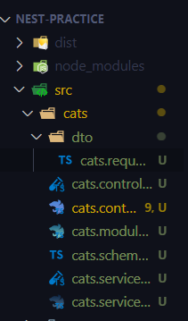
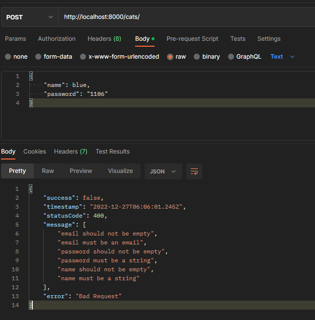
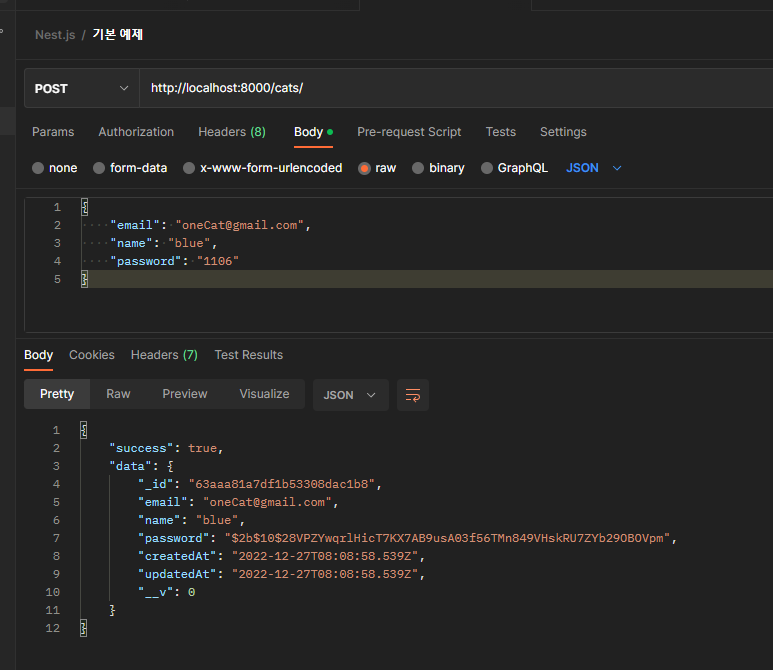

# 회원 가입 서비스 개발 & DTO 패턴

[TOC]


# 회원 가입 시 입력 필드를 검증해 줄 DTO(Data Transer Object) 패턴

> 클라이언트에서 바디에 실어서 데이터를 보냈을 때, DTO 객체로 만들어서 validation 과정을 거쳐 controller로, controller에서 그 객체를 service로, service가 DB로 보내는 방식이다.

## DTO 폴더 및 파일 생성



### **cats.controller.ts**

```typescript
import { IsEmail, IsString, IsNotEmpty } from 'class-validator';

export class CatRequestDto {
  @IsEmail()
  @IsNotEmpty()
  email: string;

  @IsString()
  @IsNotEmpty()
  name: string;

  @IsString()
  @IsNotEmpty()
  password: string;
}
```

## Controller에 적용

```typescript
...
  @Post()
  async signUp(@Body() body: CatRequestDto) {
    console.log(body);
    return 'sign up';
  }
}

```

### 테스트(갑자기 에러 발생해서 강사님 프로젝트 clone. 아마 라이브러리 간 의존성 문제 같다.)



## Service에게 데이터 넘겨 주기

### **cats.controller.ts** 

> 의존성 주입된 catsService에게 body를 보내주면, 이제 만들 예정인 signUp 함수에서 비즈니스 로직을 수행 후 클라이언트에게 데이터를 반환한다. 

```typescript
  ...
  @Post()
  async signUp(@Body() body: CatRequestDto) {
    return this.catsService.signUp(body);
  }
...
```

## Service에서 DB에 데이터를 저장하기 위해 schema DI하기

### **cats.service.ts**에서 DI

```typescript
import { Injectable } from '@nestjs/common';
import { InjectModel } from '@nestjs/mongoose';

@Injectable()
export class CatsService {
  // DB에 저장하기 위해 schema를 사용하고자 DI처리
  constructor(@InjectModel(Cat.name) private readonly catModel: Model<Cat>) {}
  // DTO 객체를 받는다.
  signUp(body: CatsRequestDto) {}
}
```

### cats.module.ts에 해당 schema 등록

```typescript
import { Module } from '@nestjs/common';
import { MongooseModule } from '@nestjs/mongoose';
import { CatsController } from './cats.controller';
import { CatsService } from './cats.service';
import { Cat, CatSchema } from './cats.schema';

@Module({
  imports: [
    MongooseModule.forFeature([{ name: 'Cat.name', schema: CatSchema }]),
  ],
  controllers: [CatsController],
  providers: [CatsService],
  exports: [CatsService],
})
export class CatsModule {}
```

## Service에서 예외 처리, 비밀번호 암호화 후 DB에 저장하기

### Hashing 라이브러리 설치

```bash
$ npm i bcrypt
$ npm i -D @types/bcrypt
```

### cats.service.ts

```typescript
import { Injectable } from '@nestjs/common';
import { HttpException } from '@nestjs/common/exceptions';
import { InjectModel } from '@nestjs/mongoose';
import { Model } from 'mongoose';
import { Cat } from './cats.schema';
import { CatRequestDto } from './dto/cats.request.dto';
import * as bcrypt from 'bcrypt';

@Injectable()
export class CatsService {
  // DB에 저장하기 위해 schema를 사용하고자 DI처리
  constructor(@InjectModel(Cat.name) private readonly catModel: Model<Cat>) {}
  // DTO 객체를 받는다.
  async signUp(body: CatRequestDto) {
    const { email, name, password } = body;
    // email이 DB에 존재하는지 확인 한 후,
    const isCatExist = await this.catModel.exists({ email });
    // exception 처리를 한다.
    if (isCatExist) {
      throw new HttpException('이미 존재하는 고양이입니다.', 403);
      // == throw new UnauthorizedException('이미 존재하는 고양이입니다.');
    }
    // 비밀번호 암호화
    const hashedPassword = await bcrypt.hash(password, 10);
    // DB에 저장
    const cat = await this.catModel.create({
      email,
      name,
      password: hashedPassword,
    });
    // 저장된 cat 객체를 리턴
    return cat;
  }
}
```

## 다시 Controller에서 사용하기

### cats.controller.ts

```typescript
  @Post()
  async signUp(@Body() body: CatRequestDto) {
    return await this.catsService.signUp(body);
  }
```

### 테스트



## 저장된 데이터 MongoDB에서 확인하기

> MongoDB Compass 열기 > Databases > test > cats


## virtual field를 사용해 password가 그대로 노출되는 것을 막기 위해 schema 단계에서 숨기기

> virtual field: 실제로 DB에 저장되는 필드는 아니지만, 비즈니스 로직에서 사용할 수 있는 필드

### cats.schema.ts

```typescript
...
  readonly readOnlyData: {
    id: string;
    email: string;
    name: string;
  };
}

export const CatSchema = SchemaFactory.createForClass(Cat);

// return하고 싶은 것만 필터링하는 기능
CatSchema.virtual('readOnlyData').get(function (this: Cat) {
  return {
    id: this.id,
    email: this.email,
    name: this.name,
  };
});
```

### cats.service.ts

```typescript
...
	// 저장된 cat 객체를 리턴
    return cat.readOnlyData;
  }
}
```

### 테스트

