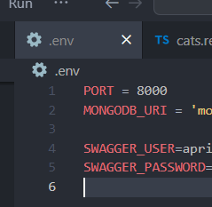
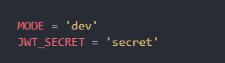
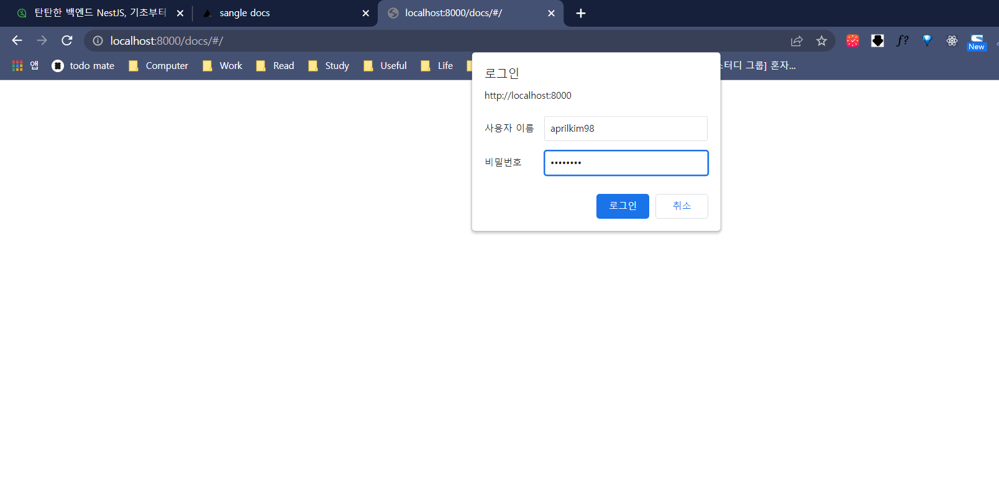
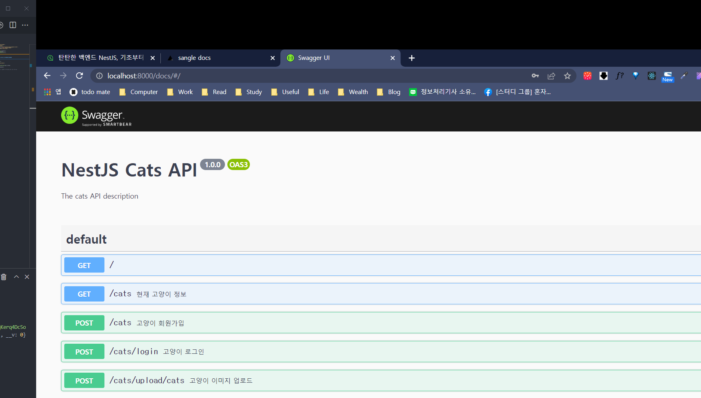
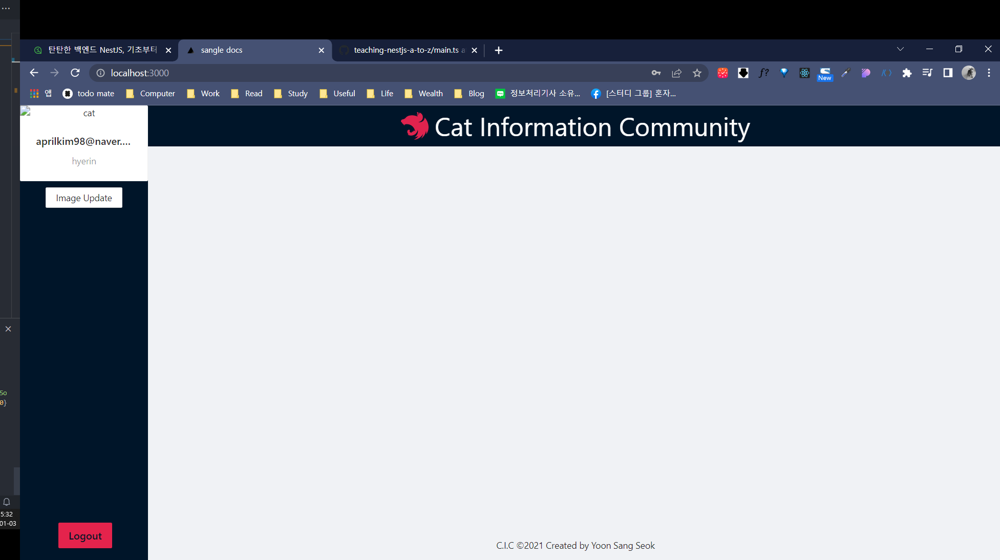

# Swagger API 보안 설정 & 로그인 API 프론트엔드와 연결


> FE 코드와 실제 연결해보는 시간을 가지려고 한다.

[TOC]

# Swagger 보안 설정

> Swagger를 아무나 볼 수 있다면 심각한 보안 문제가 초래될 수 있다.

## 1. 라이브러리 설치

> https://www.npmjs.com/package/express-basic-auth

```bash
$ npm install express-basic-auth
```

## 2. main.ts 에서 미들웨어 추가

### 2-1. main.ts

```typescript
...
async function bootstrap() {
  const app = await NestFactory.create(AppModule);
  app.useGlobalPipes(new ValidationPipe());
  app.useGlobalFilters(new HttpExceptionFilter());
  app.use(
    ['/docs', '/docs-json'],
    expressBasicAuth({
      challenge: true,
      users: {
        [process.env.SWAGGER_USER]: process.env.SWAGGER_PASSWORD,
      },
    }),
  );
...
```

## 3. .env에서 SWAGGER_USER와 SWAGGER_PASSWORD 설정



## 4. MODE와 JWT_SECRET 설정



### auth.module.ts

```typescript
      secret: process.env.JWT_SECRET,
```

### jwt.strategy.ts

```typescript
      secretOrKey: process.env.JWT_SECRET,
```

## 5. 모듈에서 환경 변수 사용이 가능하도록 설정

### auth.module.ts

```typescript
import { ConfigModule } from '@nestjs/config';

@Module({
  imports: [
    ConfigModule.forRoot(),
```

## 6. 테스트






# 로그인 API 연결


