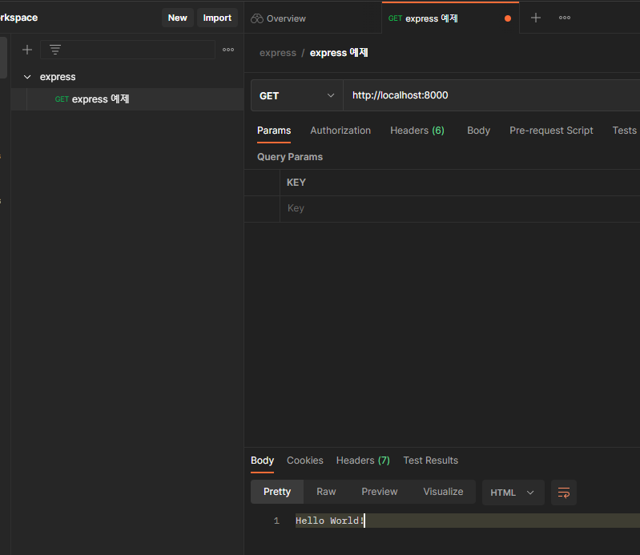
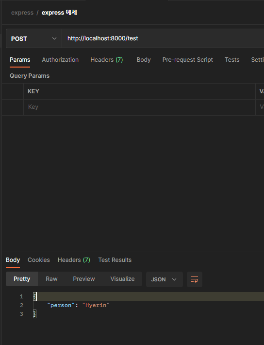

# Postman 설치

[TOC]

# URL

https://www.postman.com/downloads/

# 요청 보내기

## GET

```typescript
import * as express from 'express';

// app: 서버 역할, express의 인스턴스
const app: express.Express = express()
const port: number = 8000

// get(): 서버에 요청이 들어왔을 때 어떤 동작을 할지 정의하는 라우터
app.get('/', (req, res) => {
  console.log(req)
  res.send('Hello World!')})

// listen(): 서버를 실행하는 메서드
app.listen(port, () => console.log(`Example app listening on port http://localhost:${port}`))
```




## POST

```typescript
app.post('/test', (req, res) => {
  res.send({person: 'Hyerin'})
})
```

