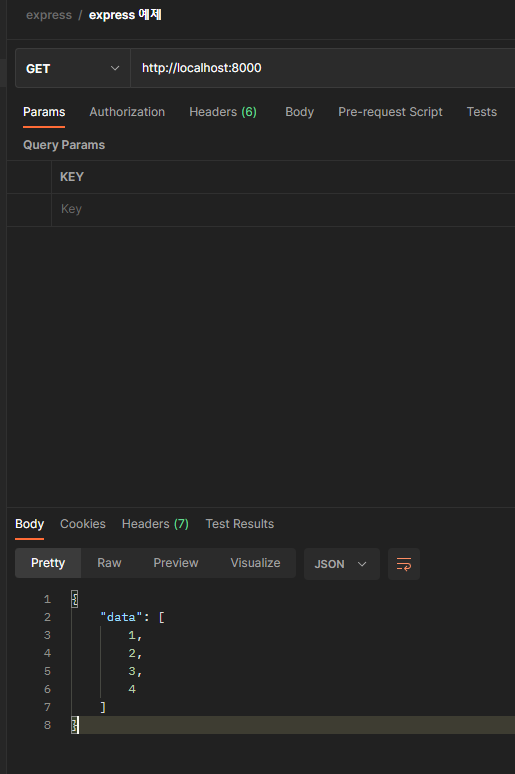

# 고양이 데이터 모킹하기

# data 보내기 연습

**app.ts**

```typescript
// 고양이 데이터 모킹하기
const data = [1, 2, 3, 4]

app.get('/', (req: express.Request, res: express.Response) => {
  console.log(req)
  // key와 value가 같으면 하나만 써도 됨
  res.send({data})
} )

// listen(): 서버를 실행하는 메서드
// app.listen(port, () => console.log(`Example app listening on port http://localhost:${port}`))
app.listen(8000, () => {
  console.log('server is on...')
})
```



# 실습

## 고양이 데이터 생성

**app.module.ts**

```typescript
export type CatType = {

  id: string;
  
  name: string;
  
  age: number;
  
  species: string;
  
  isCute: boolean;
  
  friends: string[];
  
  };
  
  
  
  export const Cat: CatType[] = [
  
  {
  
  id: 'fsduifh',
  
  name: 'blue',
  
  age: 8,
  
  species: 'Russian Blue',
  
  isCute: true,
  
  friends: ['asdfhj29009', 'WE09tju2j'],
  
  },
  
  {
  
  id: 'iohf2309q4hr',
  
  name: 'som',
  
  age: 4,
  
  species: 'Sphynx cat',
  
  isCute: true,
  
  friends: ['weju0fj20qj', 'asdfhj29009', 'weju0fj20qj'],
  
  },
  
  {
  
  id: 'WE09tju2j',
  
  name: 'lean',
  
  age: 6,
  
  species: 'Munchkin',
  
  isCute: false,
  
  friends: [],
  
  },
  
  {
  
  id: 'asdfhj29009',
  
  name: 'star',
  
  age: 10,
  
  species: 'Scottish Fold',
  
  isCute: true,
  
  friends: ['weju0fj20qj'],
  
  },
  
  {
  
  id: 'weju0fj20qj',
  
  name: 'red',
  
  age: 2,
  
  species: 'Sharm',
  
  isCute: false,
  
  friends: [],
  
  },
  
  ];
```


## GET

**app.ts**

```typescript
import {Cat, CatType} from './app.model'

// app: 서버 역할, express의 인스턴스
const app: express.Express = express()
const port: number = 8000

// 고양이 데이터 모킹하기
const data = [1, 2, 3, 4]

app.get('/', (req: express.Request, res: express.Response) => {
  console.log(req)
  res.send({cats: Cat})
} )
```

