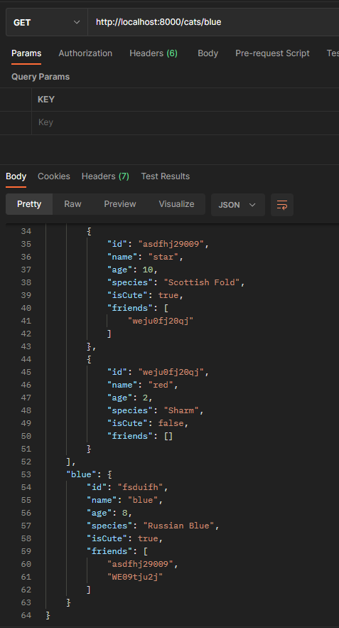

# express 미들웨어 이해하기

- express 공식 문서 :  https://expressjs.com/ko/
- https://expressjs.com/ko/guide/writing-middleware.html

# 미들웨어란?

데이터를 양쪽에서 주고 받을 수 있도록 매개 역할을 하는 것


# 실습

## middleware가 없는 경우

```typescript
// 고양이 데이터 모킹하기
// express가 위에서부터 아래로 훑으며 해당 endpoint를 찾는다.
const data = [1, 2, 3, 4]

app.get('/', (req: express.Request, res: express.Response) => {
  console.log(req)
  res.send({cats: Cat})
} )

// 미들웨어 이해하기
app.get('/cats/blue', (req, res) => {
  res.send({cats: Cat, blue: Cat[0]})})

app.get('/cats/som', (req, res) => {
  res.send({som: Cat[1]})})

// listen(): 서버를 실행하는 메서드
// app.listen(port, () => console.log(`Example app listening on port http://localhost:${port}`))
app.listen(8000, () => {
  console.log('server is on...')
})
```




## middleware를 두는 경우

> 프론트엔드와 Router 사이에 middleware를 두고, middleware가 router를 찾아 주는 것

```typescript
// 고양이 데이터 모킹하기
// express가 위에서부터 아래로 훑으며 해당 endpoint를 찾는다.

// middleware
// use(): 미들웨어를 등록하는 메서드(항상 맨 위에 위치해야 한다.)
// next: 다음 Router로 넘어가는 메서드
app.use((req, res, next) => {
  console.log(req.rawHeaders[1])
  console.log("this is middleware")
  next()
})
const data = [1, 2, 3, 4]

app.get('/', (req: express.Request, res: express.Response) => {
  console.log(req)
  res.send({cats: Cat})
} )

// 미들웨어 이해하기
app.get('/cats/blue', (req, res) => {
  res.send({cats: Cat, blue: Cat[0]})})

app.get('/cats/som', (req, res, next) => {
  console.log('this is som middleware')
  next()
})
```


## 없는 사이트에 접속했을 경우 에러 메시지를 띄워 주는 middleware

```typescript
// 404 error middleware
app.use((req, res, next) => {
  console.log('this is logging middleware')
  res.send({error: "404 not found error"})
  next()
})
```

