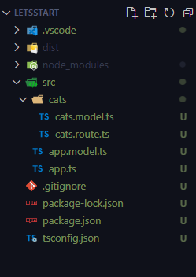

# 고양이 route 분리, 모듈화

> 코드를 `app.ts` 파일 하나에 모두 작성해 분리할 필요가 있다.

# 새로운 폴더와 파일 만들기



# Router 분리하기

**cats.route.ts**

```typescript
import {Cat, CatType} from '../app.model';
import {Router} from 'express';

// 이 router 인스턴스에 라우팅을 쭉 추가해나가는 것
const router = Router();

// * READ 고양이 전체 데이터 다 조회
router.get('/cats', (req, res) => {
  try {
    const cats = Cat;
    // throw new Error('db connect error');
    res.status(200).send({
      success: true,
      data: {
        cats,
      },
    });
  } catch (error: any) {
    res.status(400).send({
      success: false,
      error: error.message,
    })
  }
})

// * READ 특정 고양이 데이터 조회
router.get('/cats/:id', (req, res) => {
  try {
    const params = req.params;
    const cats = Cat.find((cat) => {
      return cat.id === params.id;
    });
    // throw new Error('db connect error');
    res.status(200).send({
      success: true,
      data: {
        cats,
      },
    });
  } catch (error: any) {
    res.status(400).send({
      success: false,
      error: error.message,
    })
  }
})

// * CREATE 새로운 고양이 추가
router.post('/cats', (req, res) => {
  try {
    const data = req.body;
    Cat.push(data)
    res.status(200).send({
      success: true,
      data: {data},
    });
  } catch (error: any) {
    res.status(400).send({
      success: false,
      error: error.message,
    })
  }
})

export default router;
```

**app.ts**

```typescript
import * as express from 'express'
import catsRouter from './cats/cats.route'

// app: 서버 역할, express의 인스턴스
const app: express.Express = express()
const port: number = 8000

// * logging middleware
app.use((req, res, next) => {
  console.log(req.rawHeaders[1])
  console.log("this is logging middleware")
  next()
})

// * JSON parsing middleware
app.use(express.json())

// * routing middleware
app.use(catsRouter)

// * 404 error middleware
app.use((req, res, next) => {
  console.log('this is logging middleware')
  res.send({error: "404 not found error"})
  next()
})

// listen(): 서버를 실행하는 메서드
// app.listen(port, () => console.log(`Example app listening on port http://localhost:${port}`))
app.listen(8000, () => {
  console.log('server is on...')
})
```

