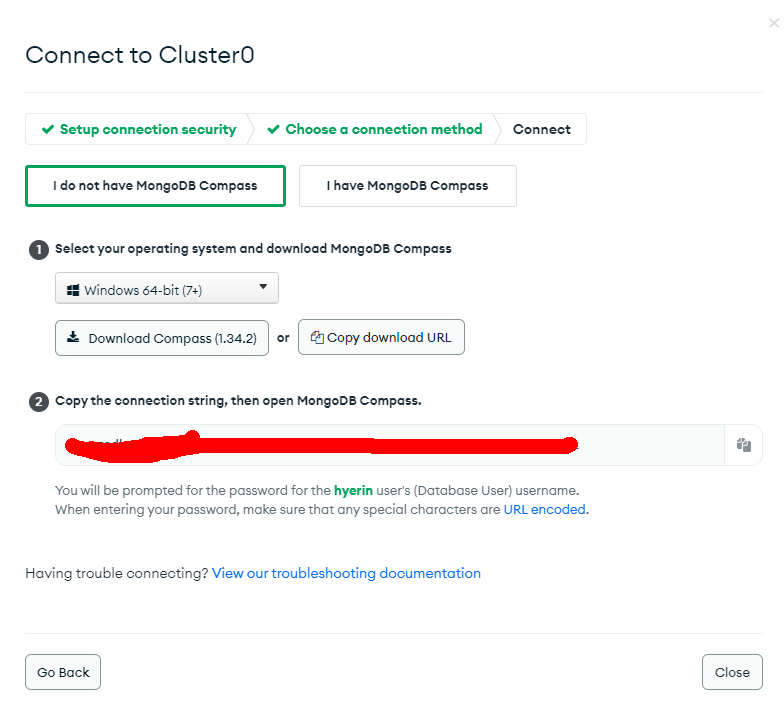

# MongoDB 접근 권한 설정 & Compass 셋업

[TOC]

# cluster 설정하기

## IP 주소 추가

`SECURITY - Network Access`

`ALLOW ACCESS FROM ANYWHERE`

## User 추가

`SECURITY - Database Access`

# Cluster Connect

## 다운로드된 `.exe`파일 연 후 connection string 붙여 넣기

> 해당 connection string은 Nest.js에서 환경 변수로 사용하게 된다.

