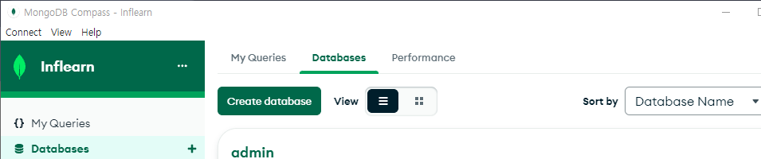
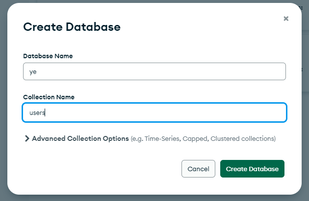
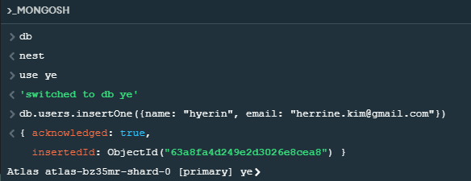
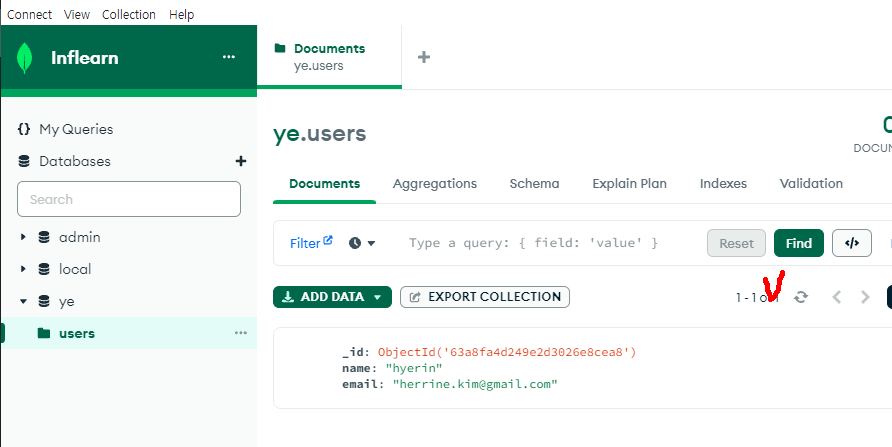
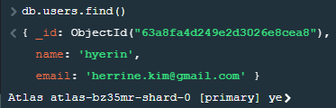
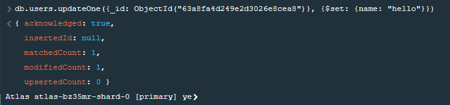
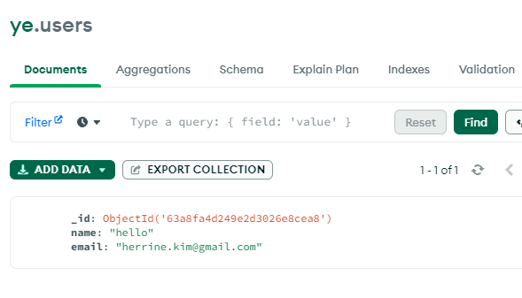

# MongoDB CRUD

# 1. Create Databse

# 2. Mongo Shell로 유저 create

> 나중에는 *Mongoose에서 제공하는 조금 더 쉬운 명령어를 사용할 계획이다.
> *Mongoose: 문서를 DB에서 조회할 때 자바스크립트 객체로 바꿔 주는 역할(ODM)

# 

# 3. 유저 read

# 4. 유저 update

