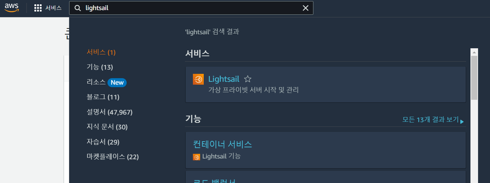
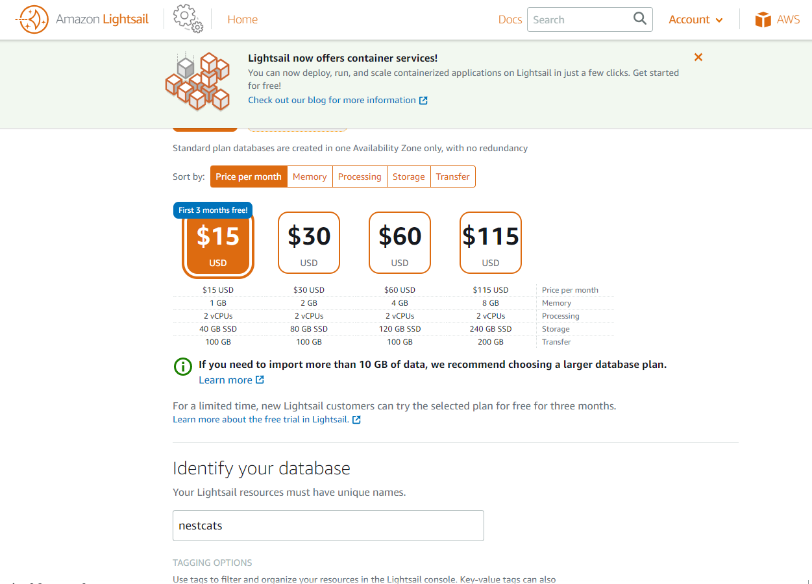
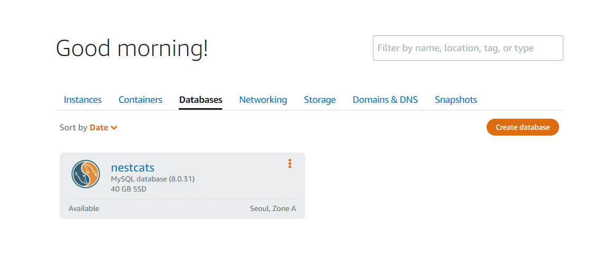
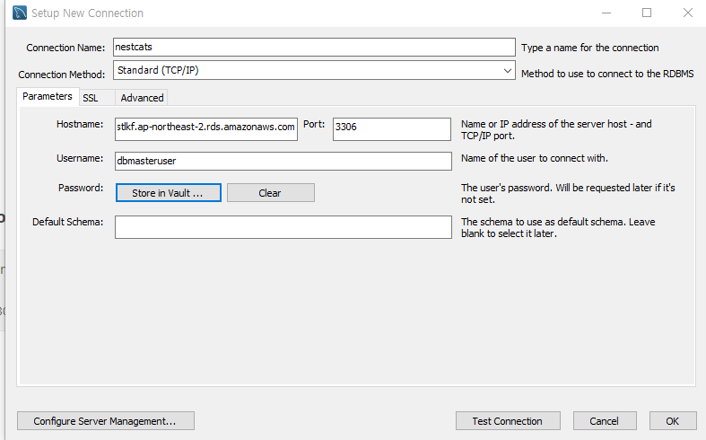
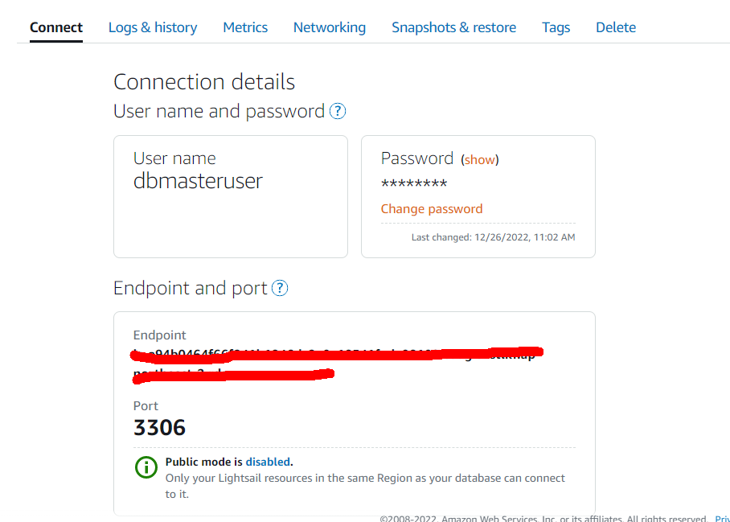
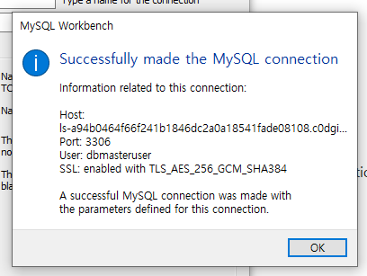
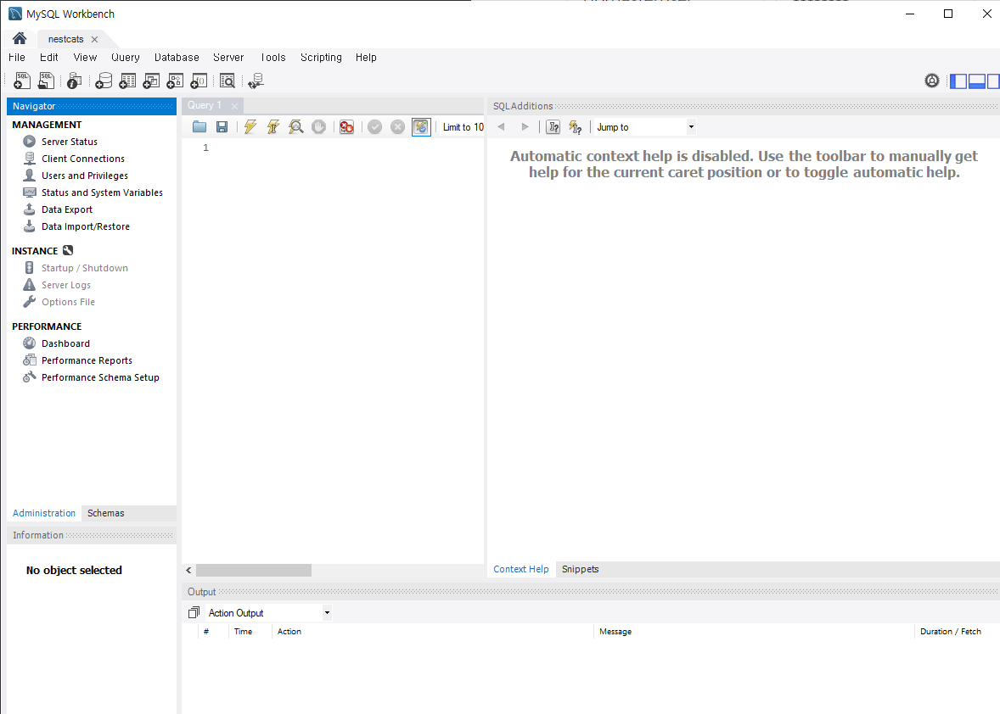

# MySQL AWS 클라우드 구축 & Workbench 연결

# 1. MySQL Workbench 다운로드

> 사전에 Python 및 Visual Studio 2019를 설치해야 한다.

# 2. MySQL 프리 티어 신청

# 3. *`Lightsail`로 접속

*Lightsail: 다음 문서에 자세히 설명

# 4. `Home - Databases - Create database`

## database 이름: nestcats

잠시 기다리면 아래와 같이 데이터베이스가 생성된다.(10분 이상 기다려야 한다.)

:star: 한 달 후부터 $15 씩 청구되기 때문에 구축 후 해지해야 한다.

# 5. MySQL Workbench `+` 

1. Username: MySQL의 User nmae
2. Hostname: MySQL의 Endpoint
3. Store in Vault: Password
4. MySQL을 Public Mode로 변경(적용되기 까지 꽤 시간이 걸린다.)

각각 진행 후 Test Connection을 해본다. 성공!

# 6. 생성된 데이터베이스 접속

