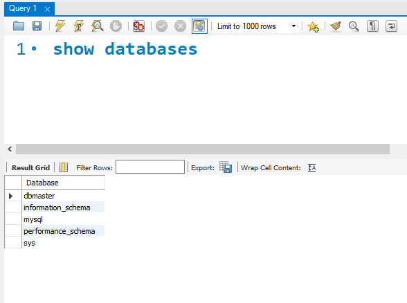
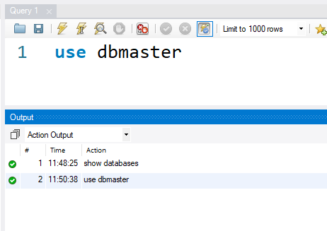
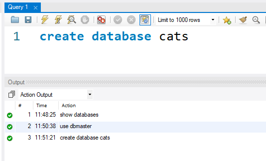
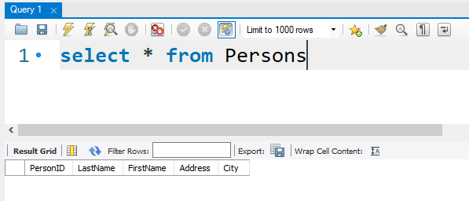
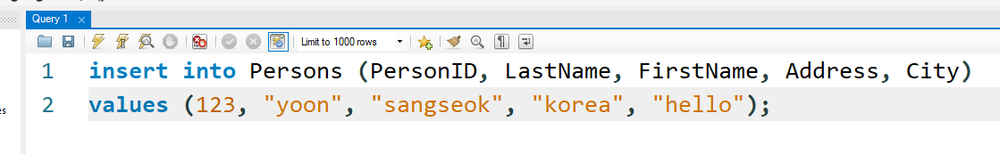
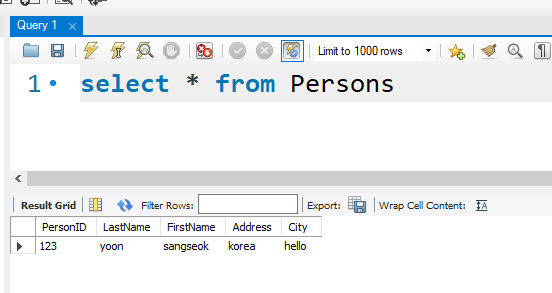

# MySQL CRUD

> 실전 프로젝트에서 사용하지는 않지만, 이후 TypeORM과 MySQL을 Nest.js와 연동해서 추가적인 프로젝트를 진행할 수 있다. 이번 편은 SQL 맛보기.

> [참조]
>
> \- SQL 문법 : https://www.w3schools.com/sql/
>
> MongoDB가 MySQL보다 쉽다는 의미는 MongoDB 문법이 자바스크립트 문법과 매우 유사해서 데이터베이스에 입문하시기에는 상대적으로 MongoDB가 쉽다는 것입니다. MongoDB가 초보자용, MySQL은 중급자용 이런 느낌은 아닙니다!
>
> Sql과 NoSql은 프로젝트 성격에 맞게 선택합니다. MySql과 MongoDB를 예로 들면, 데이터가 테이블 형식에 담기는 것이 유리한지, 도큐먼트 형식에 담기는 것이 프로젝트 데이터 구조에 유리한지를 고려하여 선택합니다. (스키마가 자주 변하고, 비정형 빅데이터를 다루는 경우에는 일반적으로 MongoDB가 유리합니다.)
>
> 특별한 시스템이 없는 프로젝트인 경우(쇼핑몰, 블로그 등) MySql을 MongoDB 대신에 사용할 수 있고 MongoDB 대신에 MySql을 사용할 수 있습니다. 제가 있는 회사에서는 MongoDB를 사용합니다.

[TOC]

# 쿼리 연습

> 쿼리 실행은 `Ctrl + Enter` 로 한다.

## 1. `show databases`

`dbmaster`: MySQL에서 기본적으로 만들어 주는 데이터베이스

## 2. `use dbmaster`

> dbmaster를 사용하겠다고 알려 준다.

## 3. `create database cats`

## 4. `use cats`

## 5. `create table Persons`  & `select`로 조회하기

## 6. `insert into ~ values ~`로 데이터 넣기

