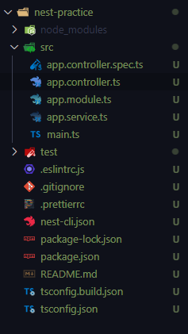
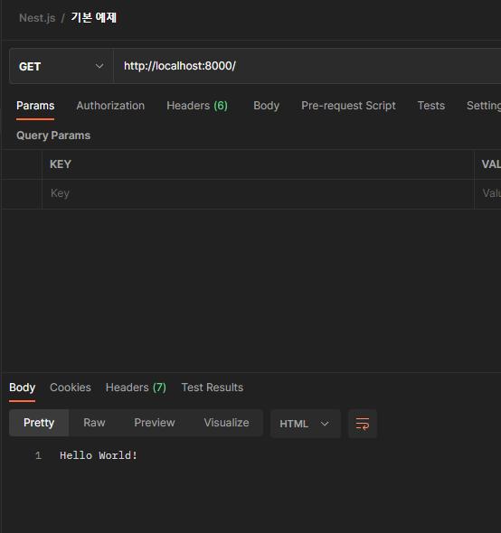

# NestJS 개발 환경 셋팅 & hello world!

> NestJS 개발 환경을 셋업하고 저번 섹션에서 다룬 express와 간단하게 비교하기
>
> [공식 문서 정리]
>
> - 공식 문서 : https://docs.nestjs.com/
> - 공식 문서 한국어 번역 : https://docs.nestjs.kr/

[TOC]

# 공식 문서를 따라 셋업하기

## 프로젝트 생성

```bash
$ npm i -g @nestjs/cli
$ nest new 프로젝트-이름
```

## `/src` 구조



`app.controller.ts`: 하나의 라우트가 있는 기본 컨트롤러. (= express의 `cats.route.ts`)

`app.service.ts`: express에서 만들었던 service. 비즈니스 로직이 실행되는 곳.

## 서버 실행

포트 번호 8000번으로 바꾸고 `npm run start`

# Postman에서 GET 요청 보내보기



## 1. `main.ts`에서 bootstrap()으로 app이 실행됨

```typescript
import { NestFactory } from '@nestjs/core';
import { AppModule } from './app.module';

async function bootstrap() {
  const app = await NestFactory.create(AppModule);
  await app.listen(8000);
}
bootstrap();
```

## 2. `app.module.ts`에서 Controller를 찾음

```typescript
import { Module } from '@nestjs/common';
import { AppController } from './app.controller';
import { AppService } from './app.service';

@Module({
  imports: [],
  controllers: [AppController],
  providers: [AppService],
})
export class AppModule {}
```

## 3. `app.controller.ts`

```typescript
@Controller()
export class AppController {
  constructor(private readonly appService: AppService) {}

  @Get()
  getHello(): string {
    return this.appService.getHello();
  }
}
```

Get 요청이 왔을 때 getHello()를 실행하고, service 안의 getHello()를 실행해 반환한다.

## 4. `app.service.ts` 

```typescript
import { Injectable } from '@nestjs/common';

@Injectable()
export class AppService {
  getHello(): string {
    return 'Hello World!';
  }
}
```

문자열 'Hello World'를 반환하는 비즈니스 로직을 실행하는 getHello() 함수가 있다.