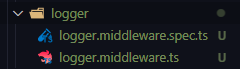
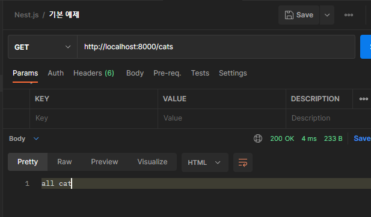
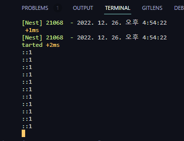

# Nest Middleware

> [공식 문서]
>
> 미들웨어는 라우트 핸들러 이전에 호출되는 함수입니다. 미들웨어 기능은 요청 및 응답 객체에 액세스 할 수 `next()` 있으며 애플리케이션의 요청-응답 주기에서 미들웨어 기능에 엑세스할 수 있습니다.

## 1. cli 통해 middleware 만들기

```bash
$ nest g middleware
? What name would you like to use for the middleware? logger
```



## 2. `logger.middleware.ts`에서 express와 같이 use 사용해 middleware 설정

```typescript
import { Injectable, NestMiddleware } from '@nestjs/common';
// 요청, 응답 객체 import하기
import { NextFunction, Request, Response } from 'express';

@Injectable()
export class LoggerMiddleware implements NestMiddleware {
  use(req: Request, res: Response, next: NextFunction) {
    // Logging하는 코드
    console.log(req.ip);
    next();
  }
}
```

## 3. 의존성 주입하기

```typescript
import { MiddlewareConsumer, NestModule, Module } from '@nestjs/common';
import { AppController } from './app.controller';
import { AppService } from './app.service';
import { CatsModule } from './cats/cats.module';
import { LoggerMiddleware } from '../src/logger/logger.middleware';

@Module({
  imports: [CatsModule],
  controllers: [AppController],
  providers: [AppService],
})
export class AppModule implements NestModule {
  configure(consumer: MiddlewareConsumer) {
    consumer.apply(LoggerMiddleware).forRoutes('*');
  }
}

```

- `consumer`: 소비자에게 logger middlerware 제공
- `logger middleware`: 의존성 주입이 가능한 provider
- `NestModule`: interface
- `forRoutes`: 특정 경로에 적용한다. 만약 와일드 카드 '*'를 사용하면 전체 경로에 적용하게 된다. 

## Postman으로 테스트하기






# Nest.js스럽게 logger 사용하기

**logger.middleware.ts**

```typescript
import { Injectable, Logger, NestMiddleware } from '@nestjs/common';
// 요청, 응답 객체 import하기
import { NextFunction, Request, Response } from 'express';

@Injectable()
export class LoggerMiddleware implements NestMiddleware {
  private logger = new Logger('HTTP');
  use(req: Request, res: Response, next: NextFunction) {
    // 결과값까지 출력하기
    res.on('finish', () => {
      this.logger.log(
        `${res.statusCode} ${res.statusMessage}`,
        `${req.ip} ${req.method}`,
        req.originalUrl,
      );
    });
    next();
  }
}

```

