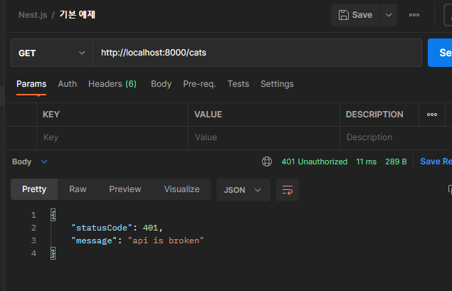
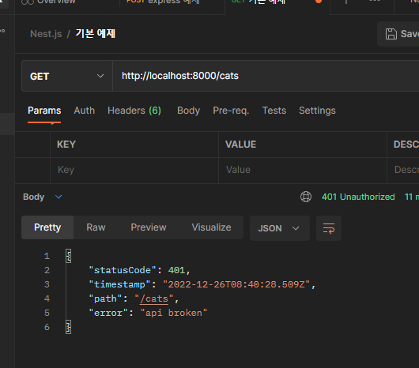
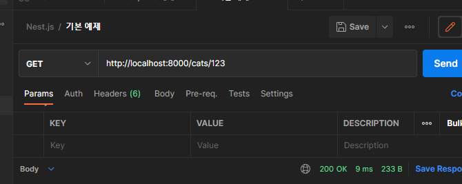
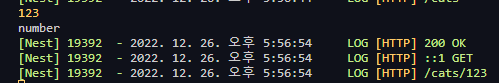
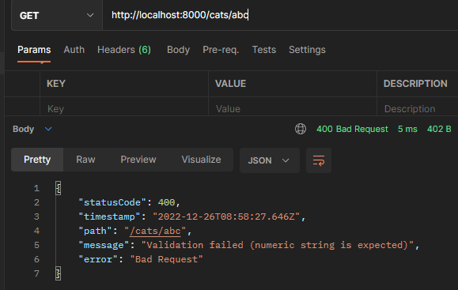
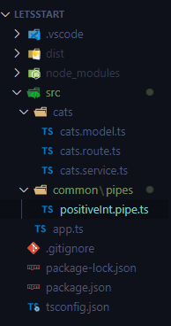

# Exception filter & Pipes

[TOC]

# Filter

> 예외 처리 방법에 대해서 배운다.

## 1. `cats.controller.ts`에서 에러 메시지를 강제로 보내보기

```typescript
  // cats/
  @Get()
  getAllCat() {
    throw new HttpException({ success: false, message: 'api is broken' }, 401);
    return 'all cat';
  }
```

### Postman으로 테스트하기



## 2. 매번 붙여 넣지 말고, 예외 처리 재사용 가능하도록 만들기

### 2-1. /src 폴더 최상단에 `http-exception.filter.ts` 파일을 만들고, 공식 문서의 코드를 가져온다.

```typescript
import {
  ExceptionFilter,
  Catch,
  ArgumentsHost,
  HttpException,
} from '@nestjs/common';
import { Request, Response } from 'express';

@Catch(HttpException)
export class HttpExceptionFilter implements ExceptionFilter {
  catch(exception: HttpException, host: ArgumentsHost) {
    // 실행 환경의 response와 request 객체를 가져온다.
    const ctx = host.switchToHttp();
    const response = ctx.getResponse<Response>();
    const request = ctx.getRequest<Request>();
    const status = exception.getStatus();

    // response 객체에 status, timestamp, path를 추가한다.
    // express에서 res.status(400).send({})와 같은 형태로 응답을 보낸다.
    response.status(status).json({
      statusCode: status,
      timestamp: new Date().toISOString(),
      path: request.url,
    });
  }
}
```

### 2-2. filter 적용하기

#### 1. `@UseFilters` 데코레이터를 사용하여 개별적으로 적용하기

**cats.controller.ts**

```typescript
import {
  Controller,
  Get,
  Post,
  Put,
  Delete,
  Patch,
  UseFilters,
} from '@nestjs/common';
import { HttpException } from '@nestjs/common/exceptions';
import { CatsService } from './cats.service';
import { HttpExceptionFilter } from 'src/http-exception.filter';

@Controller('cats')
// 이곳에 써주면 class 전체에 필터가 적용된다.
// @UseFilters(HttpExceptionFilter)
export class CatsController {
  constructor(private readonly catsService: CatsService) {}

  // cats/
  @Get()
  @UseFilters(HttpExceptionFilter)
  getAllCat() {
    // filter에 담을 error 메시지
    throw new HttpException('api broken', 401);
    return 'all cat';
  }
...
```

**http-exception.filter.ts**

```typescript
import {
  ExceptionFilter,
  Catch,
  ArgumentsHost,
  HttpException,
} from '@nestjs/common';
import { Request, Response } from 'express';

@Catch(HttpException)
export class HttpExceptionFilter implements ExceptionFilter {
  catch(exception: HttpException, host: ArgumentsHost) {
    // 실행 환경의 response와 request 객체를 가져온다.
    const ctx = host.switchToHttp();
    const response = ctx.getResponse<Response>();
    const request = ctx.getRequest<Request>();
    const status = exception.getStatus();
    const error = exception.getResponse();

    // response 객체에 status, timestamp, path를 추가한다.
    // express에서 res.status(400).send({})와 같은 형태로 응답을 보낸다.
    response.status(status).json({
      statusCode: status,
      timestamp: new Date().toISOString(),
      path: request.url,
      // key와 value가 똑같아 생략 가능하다.
      error,
    });
  }
}
```

##### 테스트




#### 2. 전역적으로 적용하기

**main.ts**

```typescript
import { NestFactory } from '@nestjs/core';
import { AppModule } from './app.module';
import { HttpExceptionFilter } from './http-exception.filter';

async function bootstrap() {
  const app = await NestFactory.create(AppModule);
  app.useGlobalFilters(new HttpExceptionFilter());
  await app.listen(8000);
}
bootstrap();
```

### 분기 처리하기

**http-exception.filter.ts**

```typescript
import {
  ExceptionFilter,
  Catch,
  ArgumentsHost,
  HttpException,
} from '@nestjs/common';
import { Request, Response } from 'express';

@Catch(HttpException)
export class HttpExceptionFilter implements ExceptionFilter {
  catch(exception: HttpException, host: ArgumentsHost) {
    // 실행 환경의 response와 request 객체를 가져온다.
    const ctx = host.switchToHttp();
    const response = ctx.getResponse<Response>();
    const request = ctx.getRequest<Request>();
    const status = exception.getStatus();
    const error = exception.getResponse() as
      | string
      | { error: string; statusCode: number; message: string | string[] };

    // response 객체에 status, timestamp, path를 추가한다.
    // express에서 res.status(400).send({})와 같은 형태로 응답을 보낸다.

    // error가 string이면 그대로 보내고
    // error가 object이면 ...error로 key와 value를 분리해서 보낸다.
    if (typeof error === 'string') {
      response.status(status).json({
        statusCode: status,
        timestamp: new Date().toISOString(),
        path: request.url,
        // key와 value가 똑같아 생략 가능하다.
        error,
      });
    } else {
      response.status(status).json({
        statusCode: status,
        timestamp: new Date().toISOString(),
        ...error,
      });
    }
  }
}
```


# Pipes

> 클라이언트 요청에서 들어오는 데이터를 유효성 검사 및 변환을 수행하여 서버가 원하는 데이터를 얻을 수 있도록 도와주는 클래스

## param 타입 변환 및 유효성 검사 가능

**cats.controller.ts**

```typescript
  // cats/:id
  @Get(':id')
  // string으로 들어오는 id를 pipe로 number로 변환한다.
  getOneCat(@Param('id', ParseIntPipe) param: number) {
    console.log(param);
    console.log(typeof param);
    return 'one cat';
  }
```

### 테스트





### 테스트 2



*numeric string: numbers in string format


## [보충] Pipe 패턴에 대하여

https://docs.microsoft.com/en-us/azure/architecture/patterns/pipes-and-filters

파이프는 단방향 통신을 위한 용도로 사용됩니다. 하나의 파이프는 이전 파이프에서 전달된 결과를 입력 값으로 받아 또 다른 결과 값을 내놓습니다. NestJS에서의 파이프는 클라이언트 요청에서 들어오는 데이터를 유효성 검사 및 변환을 수행하여 서버가 원하는 데이터를 얻을 수 있도록 도와주는 역할을 합니다.

### 실습해보기



