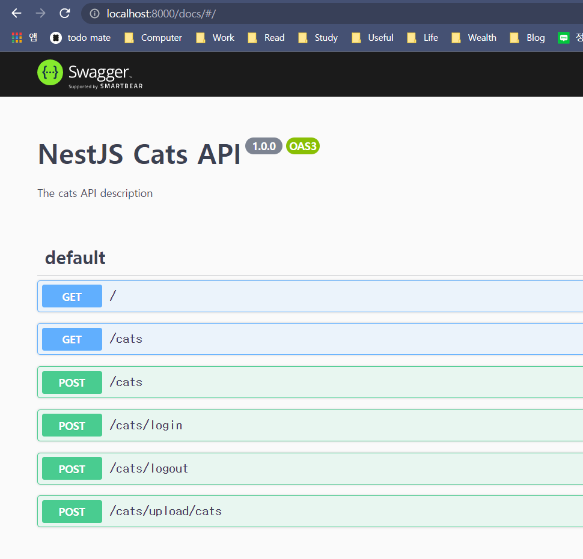
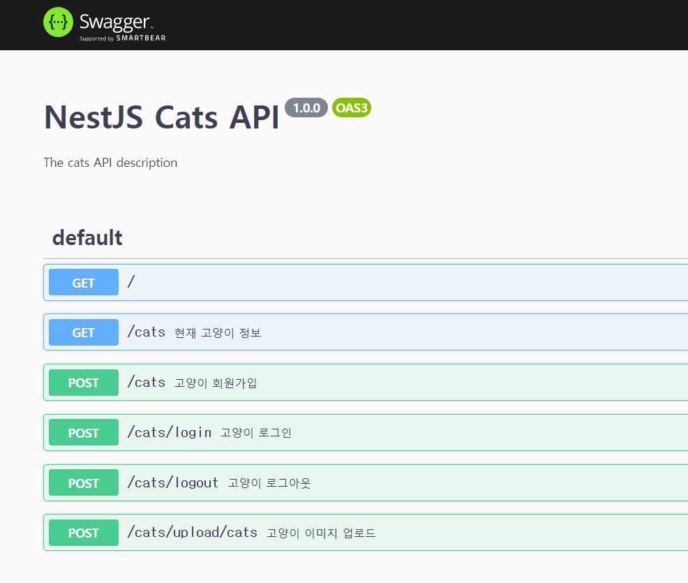
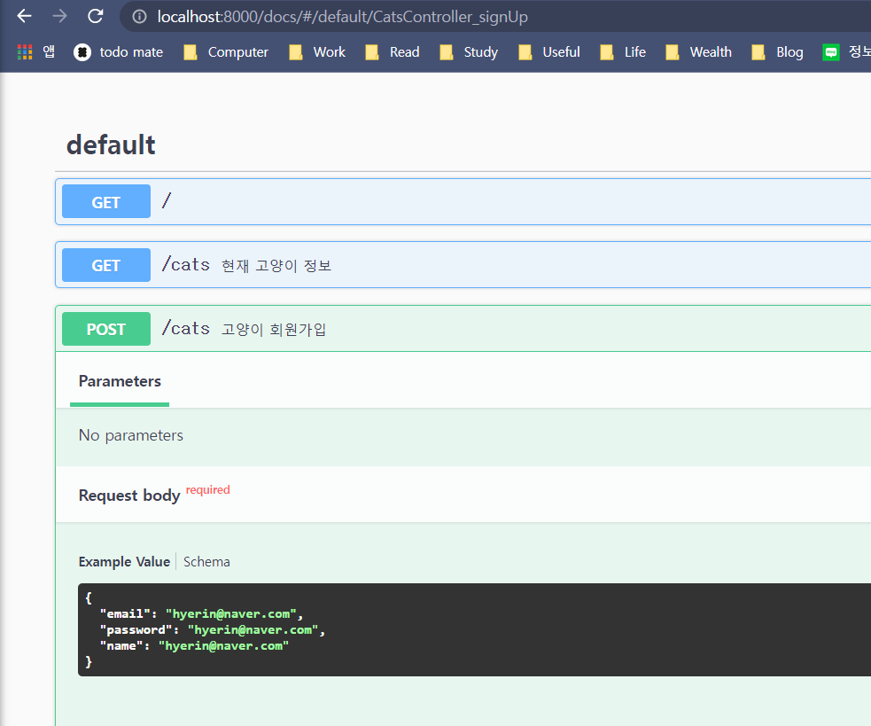
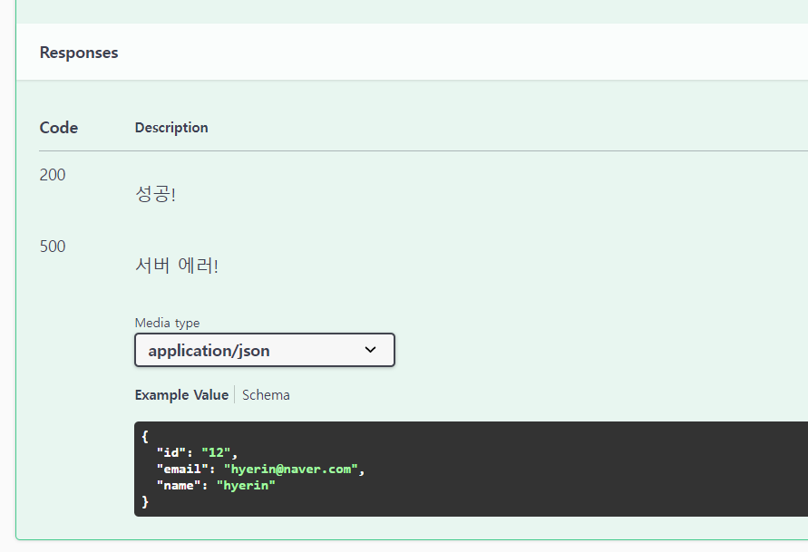

# NestJS와 fastify & 협업을 위한 API 문서 만들기, CORS 문제

> NestJS 7 버전 - Swagger 4 버전(구 버전)으로 진행

[TOC]

# Fastify

express와 비슷한 웹 프레임워크. 구조적으로나 속도 면에서나 더 우수하지만, NestJS는 express 위에서 돌아간다. 우선 express 위에서 개발한 후, 속도가 높일 필요가 있는 API의 경우에 fastify로 리팩토링하는 것을 추천한다.


# Swagger

> https://docs.nestjs.com/openapi/introduction

## 설치

```bash
$ npm install --save @nestjs/swagger@4
```

## main.ts

```typescript
import { ValidationPipe } from '@nestjs/common';
import { NestFactory } from '@nestjs/core';
import { AppModule } from './app.module';
import { HttpExceptionFilter } from './common/exceptions/http-exception.filter';
import { SwaggerModule, DocumentBuilder } from '@nestjs/swagger';

async function bootstrap() {
  const app = await NestFactory.create(AppModule);
  app.useGlobalPipes(new ValidationPipe());
  app.useGlobalFilters(new HttpExceptionFilter());

  const config = new DocumentBuilder()
    .setTitle('NestJS Cats API')
    .setDescription('The cats API description')
    .setVersion('1.0.0')
    .build();
  const document = SwaggerModule.createDocument(app, config);
  // docs: Swagger API의 endpoint
  SwaggerModule.setup('docs', app, document);
  const PORT = process.env.PORT;
  await app.listen(PORT);
}
bootstrap();
```

## 테스트

> http://localhost:8000/docs/



## FE가 잘 이해할 수 있도록 설명 써주기

### cats.controller.ts

```typescript
  ...
  @ApiOperation({ summary: '현재 고양이 정보' })
  @Get()
  getCurrentCat() {
    return 'current cat';
  }

  @ApiOperation({ summary: '고양이 회원가입' })
  @Post()
  async signUp(@Body() body: CatRequestDto) {
    return await this.catsService.signUp(body);
  }

  @ApiOperation({ summary: '고양이 로그인' })
  @Post('login')
  logIn() {
    return 'login';
  }

  @ApiOperation({ summary: '고양이 로그아웃' })
  @Post('logout')
  logOut() {
    return 'logout';
  }

  @ApiOperation({ summary: '고양이 이미지 업로드' })
  @Post('upload/cats')
  uploadCatImg() {
    return 'uploadImg';
  }
}
```



## DTO에서 Swagger Request Body 형태 지정해주기

### cats.request.dto.ts

```typescript
import { ApiProperty } from '@nestjs/swagger';
import { IsEmail, IsNotEmpty, IsString } from 'class-validator';

export class CatRequestDto {
  @ApiProperty({
    example: 'hyerin@naver.com',
    description: 'email',
    required: true,
  })
  @IsEmail()
  @IsNotEmpty()
  email: string;

  @ApiProperty({
    example: 'hyerin@naver.com',
    description: 'email',
    required: true,
  })
  @IsString()
  @IsNotEmpty()
  password: string;

  @ApiProperty({
    example: 'hyerin@naver.com',
    description: 'email',
    required: true,
  })
  @IsString()
  @IsNotEmpty()
  name: string;
}
```



## 마지막으로, Controller에서 Swagger Response 형태 지정해주기

### cats.dto.ts라는 새로운 dto 생성하고, readOnlyData를 받아 검증한다. 해당 DTO를 controller의 @ApiResponse 데코레이터 안에 넣어 주기

```typescript
  @ApiResponse({
    status: 200,
    description: '성공!',
  })
  @ApiResponse({
    status: 500,
    description: '서버 에러!',
    type: ReadOnlyCatDto,
  })
  @ApiOperation({ summary: '고양이 회원가입' })
  @Post()
  async signUp(@Body() body: CatRequestDto) {
    return await this.catsService.signUp(body);
  }

```

```typescript
import { ApiProperty } from '@nestjs/swagger';

export class ReadOnlyCatDto {
  @ApiProperty({
    example: '12',
    description: 'id',
    required: true,
  })
  id: string;

  @ApiProperty({
    example: 'hyerin@naver.com',
    description: 'email',
    required: true,
  })
  email: string;

  @ApiProperty({
    example: 'hyerin',
    description: 'name',
    required: true,
  })
  name: string;
}

```

### 확인




# 상속 개념을 사용해 DTO 재사용성 있도록 살려서 만들기

## Cat 상속 받기
