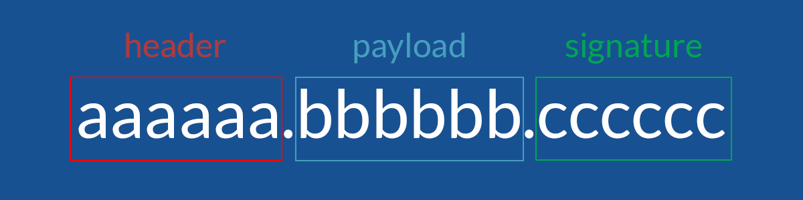
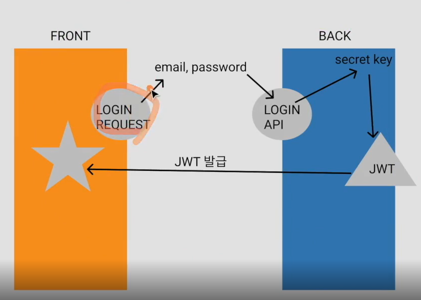
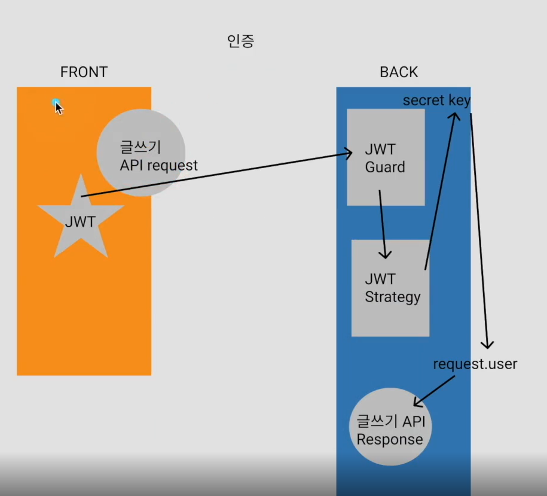
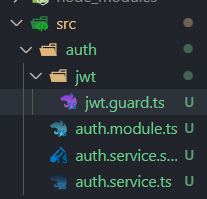
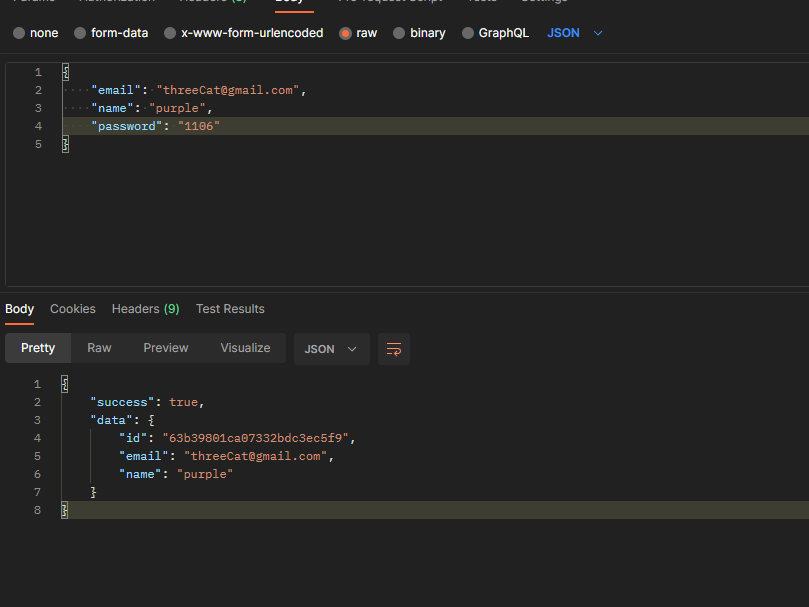
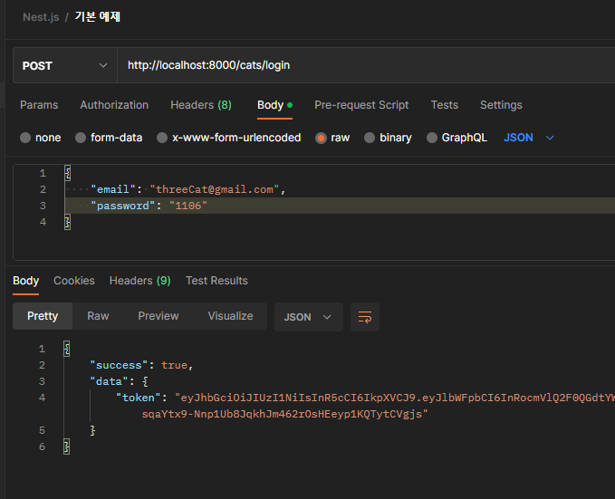
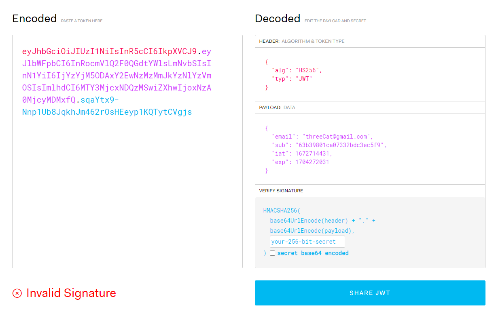

# JWT와 로그인 서비스 & 순환 참조 모듈

> 이번 시간에는 JWT를 사용해 로그인을 구현 해본다. 로그인을 구현하는 데는 session, cookie를 사용할 수도 있고, JWT를 사용할 수도 있고, 그냥 token을 사용할 수도 있다.
>
> - JWT : https://jwt.io/
> - JWT에 대해 추가 설명된 블로그 글입니다! 꼭 읽어 주세요!
>   https://hudi.blog/self-made-jwt/

[TOC]

# JWT 사용 이유

Web BE뿐만 아니라 APP BE도 지원하도록 폭넓은 지식을 알려 주는 목적이기 때문이다.

## JWT란?



JWT는 JSON Web Token의 줄임말로, JSON 포맷을 사용해 사용자 정보를 저장하는 Web token이라고 할 수 있다. 

JWT는 온점(.)을 기준으로 세 부분으로 나눠져 있는데, 각각 헤더, 페이로드, 시그니쳐라고 한다.

### Header

토큰의 타입과 알고리즘을 base64로 인코딩한 것

### Payload

base64 인코딩 데이터(key-value 쌍)

### Signature

Header, Payload를 조합하고 비밀키로 서명한 후, base64로 인코딩

# JWT 로그인의 프로세스



1. FE에서 Login Request한다. Login API를 Request할 때 필요한 email과 password를 보내면 BE에서는 이것을 secret key로 sign하여 JWT로 만든다.
2. 만들어진 JWT를 FE에게 발급해 준다.
3. FE는 발급된 JWT를 안전한 공간에 저장한다.

## 안전한 공간

보통은 Localstorage나 HTTP only cookie에 저장하는 경우가 많다.

## 인증 과정

> 로그인 & JWT가 안전한 공간에 잘 저장되어 있는 상태라고 가정한다.



1. 글쓰기 API를 보낼 때, Header에 JWT를 실어서 함께 보내 준다.
2. BE는 그것을 받아 JWT Guard를 통해 JWT Strategy를 실행하고, secret를 사용해 디코딩해 해당하는 유저를 request.user에 저장한다.
3. user의 정보를 읽어 글쓰기 API의 비즈니스 로직을 수행한 후 Response를 보낸다.

### Guard

#### 정의

https://docs.nestjs.com/guards

#### Lifecycle에서도 볼 수 있다.

https://docs.nestjs.com/faq/request-lifecycle


# Nest.js에서 실습하기

> https://docs.nestjs.com/security/authentication

## 1. 설치

```bash
$ npm install --save @nestjs/passport passport passport-local
$ npm install --save-dev @types/passport-local
```

```bash
$ npm install --save @nestjs/jwt passport-jwt
$ npm install --save-dev @types/passport-jwt
```

## 2. 모듈 생성

```bash
$ nest g module auth
$ nest g service auth
```

## 3.  JWT Guard, Strategy 생성



### 3-1. jwt.guard.ts

```typescript
import { Injectable } from '@nestjs/common';
import { AuthGuard } from '@nestjs/passport';

@Injectable()
// AuthGuard: strategy를 자동으로 실행
export class JwtAuthGuard extends AuthGuard('jwt') {}
```

### 3-2. jwt.strategy.ts

```typescript
import { ExtractJwt, Strategy } from 'passport-jwt';
import { PassportStrategy } from '@nestjs/passport';
import { Injectable } from '@nestjs/common';

@Injectable()
export class JwtStrategy extends PassportStrategy(Strategy) {
  constructor() {
    super({
      // Header의 토큰 추출
      jwtFromRequest: ExtractJwt.fromAuthHeaderAsBearerToken(),
      // 토큰 만료 시간이 있음
      ignoreExpiration: false,
      // 추후 환경변수로 설정
      secretOrKey: 'secret',
    });
  }

  // payload를 검증
  async validate(payload) {}
}
```

## 4. auth.module.ts에 필요한 모듈들 import하기

### 4-1. auth.module.ts

```typescript
import { Module } from '@nestjs/common';
import { AuthService } from './auth.service';
import { PassportModule } from '@nestjs/passport';
import { JwtModule } from '@nestjs/jwt';
import { JwtStrategy } from './jwt/jwt.strategy';

@Module({
  imports: [
    PassportModule.register({ defaultStrategy: 'jwt', session: false }),
    JwtModule.register({
      secret: 'secret',
      signOptions: { expiresIn: '1y' },
    }),
  ],
  providers: [AuthService, JwtStrategy],
})
export class AuthModule {}
```

## 5. 로그인 과정 service 구현하기

### 5-1. login.request.dto.ts에 login request dto만들기

```typescript
import { PickType } from '@nestjs/swagger';
import { Cat } from 'src/cats/cats.schema';

export class LoginRequestDto extends PickType(Cat, [
  'email',
  'password',
] as const) {}
```

### 5-2. 만들어 두었던 cats.repostory.ts에 findCatByEmail 함수 추가

```typescript
import { HttpException, Injectable } from '@nestjs/common';
import { InjectModel } from '@nestjs/mongoose';
import { Model } from 'mongoose';
import { Cat } from './cats.schema';
import { CatRequestDto } from './dto/cats.request.dto';

@Injectable()
export class CatsRepository {
  constructor(@InjectModel(Cat.name) private readonly catModel: Model<Cat>) {}
  async findCatByEmail(email: string): Promise<Cat | null> {
    const cat = await this.catModel.findOne({ email });
    return cat;
  }
  // Service에서 구현했던 isCatExist 함수와 같은 함수를 만들기
  async existsByEmail(email: string): Promise<boolean> {
    try {
      const result = await this.catModel.exists({ email });
      return result;
    } catch (error) {
      throw new HttpException('db error', 400);
    }
  }
  // create도 만들기
  async create(cat: CatRequestDto): Promise<Cat> {
    return await this.catModel.create(cat);
  }
}
```

### 5-3. auth.module.ts에 CatsModule 등록 후 export 처리까지!

```typescript
import { forwardRef, Module } from '@nestjs/common';
import { AuthService } from './auth.service';
import { PassportModule } from '@nestjs/passport';
import { JwtModule } from '@nestjs/jwt';
import { JwtStrategy } from './jwt/jwt.strategy';
import { CatsModule } from 'src/cats/cats.module';

@Module({
  imports: [
    PassportModule.register({ defaultStrategy: 'jwt', session: false }),
    JwtModule.register({
      secret: 'secret',
      signOptions: { expiresIn: '1y' },
    }),
    // CatsModule 자체를 import하여 그곳에서 export한 것을 사용
    forwardRef(() => CatsModule),
  ],
  providers: [AuthService, JwtStrategy],
  exports: [AuthService],
})
export class AuthModule {}
```

### 5-4. cats.module.ts에서 CatsRepository도 exports 처리

```typescript
import { Module } from '@nestjs/common';
import { MongooseModule } from '@nestjs/mongoose';
import { CatsController } from './cats.controller';
import { CatsService } from './cats.service';
import { Cat, CatSchema } from './cats.schema';
import { CatsRepository } from './cats.repository';

@Module({
  imports: [MongooseModule.forFeature([{ name: Cat.name, schema: CatSchema }])],
  controllers: [CatsController],
  providers: [CatsService, CatsRepository],
  exports: [CatsService, CatsRepository],
})
export class CatsModule {}
```

### 5-5. auth.service.ts에 service 함수 구현

```typescript
import { Injectable } from '@nestjs/common';
import { UnauthorizedException } from '@nestjs/common/exceptions';
import { CatsRepository } from 'src/cats/cats.repository';
import { LoginRequestDto } from './dto/login.request.dto';
import { JwtService } from '@nestjs/jwt';
import * as bcrypt from 'bcrypt';

@Injectable()
export class AuthService {
  // Repository: 다른 service에서 DB에 접근 가능. module에 등록하여야 service에 DI 가능
  constructor(
    private readonly catsRepository: CatsRepository,
    // auth.module.ts의 JwtModule이 생성한 jwtService를 DI
    // 이것을 사용해 JWT를 만들고, return해 줌
    private jwtService: JwtService,
  ) {}

  // service 함수 구현
  async jwtLogIn(data: LoginRequestDto) {
    const { email, password } = data;

    // * 해당하는 email이 있는지
    const cat = await this.catsRepository.findCatByEmail(email);
    if (!cat) {
      throw new UnauthorizedException('이메일과 비밀번호를 확인해주세요.');
    }

    // * 비밀번호가 일치하는지
    // bcrypt.compare(입력받은 비밀번호, DB에 저장된 비밀번호): promise 반환
    const isPasswordValidated: boolean = await bcrypt.compare(
      password,
      cat.password,
    );

    if (!isPasswordValidated) {
      throw new UnauthorizedException('이메일과 비밀번호를 확인해주세요.');
    }

    // JWT 요소 중 payload에 들어갈 내용
    const payload = { email: cat.email, sub: cat._id };

    return {
      token: this.jwtService.sign(payload),
    };
  }
}
```

## 6. service 실제로 사용하기

### 6-1. cats.module.ts에 import하기

```typescript
@Module({
  imports: [
    MongooseModule.forFeature([{ name: Cat.name, schema: CatSchema }]),
    AuthModule,
  ],
  controllers: [CatsController],
  providers: [CatsService, CatsRepository],
  exports: [CatsService, CatsRepository],
})
export class CatsModule {}
```

#### :exclamation: cat 모듈에서 auth 모듈을, auth 모듈에서는 cat 모듈을 서로 import하고 있어 순환 모듈 문제가 발생할 수 있다.

#### ✅`forwardRef()`를 사용해 해결하기

> https://docs.nestjs.com/fundamentals/circular-dependency#moduleref-class-alternative

해당 함수로 감싸 주기만 하면 끝!

##### auth.module.ts

```typescript
@Module({
  imports: [
    PassportModule.register({ defaultStrategy: 'jwt', session: false }),
    JwtModule.register({
      secret: 'secret',
      signOptions: { expiresIn: '1y' },
    }),
    // CatsModule 자체를 import하여 그곳에서 export한 것을 사용
    forwardRef(() => CatsModule),
  ],
  providers: [AuthService, JwtStrategy],
})
export class AuthModule {}
```

##### cats.module.ts

```typescript
@Module({
  imports: [
    MongooseModule.forFeature([{ name: Cat.name, schema: CatSchema }]),
    forwardRef(() => AuthModule),
  ],
  controllers: [CatsController],
  providers: [CatsService, CatsRepository],
  exports: [CatsService, CatsRepository],
})
export class CatsModule {}
```

### 6-2. cats.controller.ts에 DI하기

```typescript
import { Body, UseFilters, UseInterceptors } from '@nestjs/common';
import { Controller, Get, Post } from '@nestjs/common';
import { HttpExceptionFilter } from 'src/common/exceptions/http-exception.filter';
import { SuccessInterceptor } from 'src/common/interceptors/success.interceptor';
import { CatsService } from './cats.service';
import { CatRequestDto } from './dto/cats.request.dto';
import { ApiOperation, ApiResponse, ApiTags } from '@nestjs/swagger';
import { ReadOnlyCatDto } from './dto/cat.dto';
import { AuthService } from 'src/auth/auth.service';

@Controller('cats')
@UseInterceptors(SuccessInterceptor)
@UseFilters(HttpExceptionFilter)
export class CatsController {
  constructor(
    private readonly catsService: CatsService,
    private readonly authService: AuthService,
  ) {}

  @ApiOperation({ summary: '현재 고양이 정보' })
  @Get()
  getCurrentCat() {
    return 'current cat';
  }
...
  @ApiOperation({ summary: '고양이 로그인' })
  @Post('login')
  logIn(@Body() data: LoginRequestDto) {
    return this.authService.jwtLogIn(data);
  }
...
```


# 테스트

## 회원 가입



## 로그인



## JWT 내부 정보 디코딩해 확인하기

> https://jwt.io/



### sub

유저의 고유 식별자

### exp

만료 기간(현재 1y)


Next:arrow_right:현재 구현되지 않은 인증 시스템 구현하기