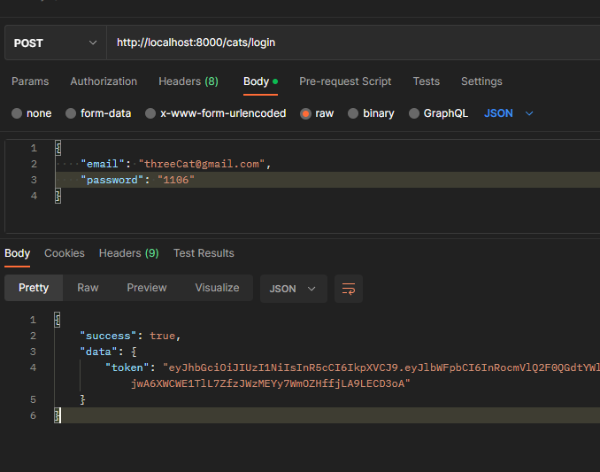
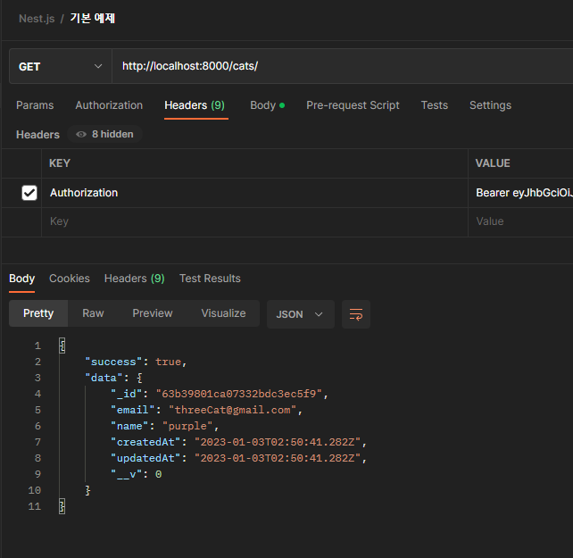
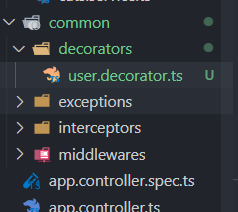

# passport와 인증 전략 & Custom decorator

[TOC]

# 현재 고양이를 가지고 오는 API 작성

## cats.controller.ts에 적용

```typescript
...
  @ApiOperation({ summary: '현재 고양이 정보' })
  // 만들어 두었던 JwtAuthGuard를 사용해 인증을 진행
  @UseGuards(JwtAuthGuard)
  @Get()
  // 인증 처리된 정보를 넘겨 줌
  getCurrentCat(@Req() req: IGetUserAuthInfoRequest) {
    return req.user;
  }
...
```

## strategy를 실행해 주는 AuthGuard 보완하기

### jwt.payload.ts에서 타입 지정

```typescript
export type Payload = {
  email: string;
  sub: string;
};
```

### cats.repository.ts에서 검색 API 작성

```typescript
...
@Injectable()
export class CatsRepository {
  constructor(@InjectModel(Cat.name) private readonly catModel: Model<Cat>) {}
  async findCatByIdWithoutPassword(catId: string): Promise<Cat | null> {
    const cat = await this.catModel.findById(catId).select('-password');
    return cat;
  }
...
```

### jwt.strategy.ts에 적용

```typescript
import { ExtractJwt, Strategy } from 'passport-jwt';
import { PassportStrategy } from '@nestjs/passport';
import { Injectable, UnauthorizedException } from '@nestjs/common';
import { Payload } from './jwt.payload';
import { CatsRepository } from 'src/cats/cats.repository';

@Injectable()
export class JwtStrategy extends PassportStrategy(Strategy) {
  constructor(private readonly catsRepository: CatsRepository) {
    super({
      // Header의 토큰 추출
      jwtFromRequest: ExtractJwt.fromAuthHeaderAsBearerToken(),
      // 토큰 만료 시간이 있음
      ignoreExpiration: false,
      // 추후 환경변수로 설정
      secretOrKey: 'secret',
    });
  }

  async validate(payload: Payload) {
    const cat = await this.catsRepository.findCatByIdWithoutPassword(
      payload.sub,
    );
    if (cat) {
      return cat; // request.user에 저장됨;
    } else {
      throw new UnauthorizedException('접근 오류');
    }
  }
}
```

## 테스트

### 1. 로그인



### 2. 받은 토큰을 Authorization 헤더에 넣고 GET 요청




# Custom Decorator

> https://docs.nestjs.com/custom-decorators

## 1. decorators 폴더와 파일 생성하기



### user.decorator.ts

```typescript
import { createParamDecorator, ExecutionContext } from '@nestjs/common';

export const CurrentUser = createParamDecorator(
  (data: unknown, ctx: ExecutionContext) => {
    const request = ctx.switchToHttp().getRequest();
    return request.user;
  },
);
```

## 2. controller에서 req.user가 있던 자리에 대체하기

### cats.controller.ts

```typescript
...
  @ApiOperation({ summary: '현재 고양이 정보' })
  // 만들어 두었던 JwtAuthGuard를 사용해 인증을 진행
  @UseGuards(JwtAuthGuard)
  @Get()
  // 인증 처리된 정보를 넘겨 줌
  getCurrentCat(@CurrentUser() cat) {
    return cat.readOnlyData;
  }
...
```

