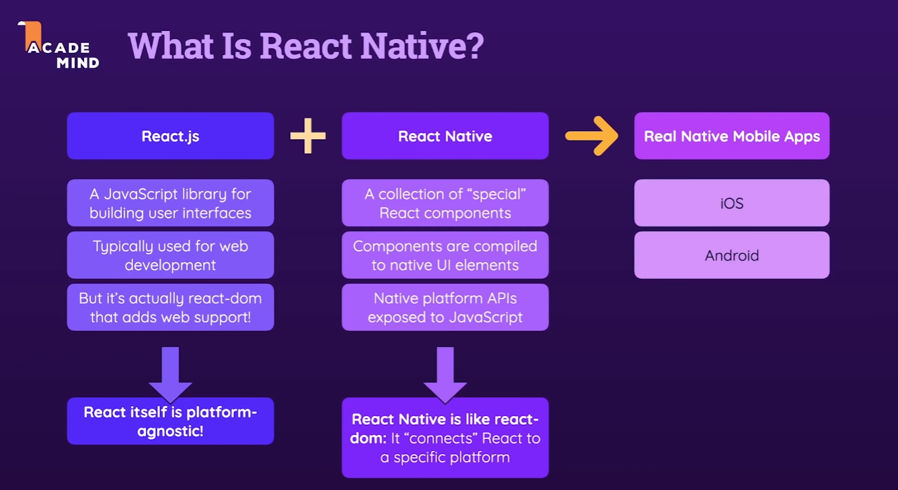
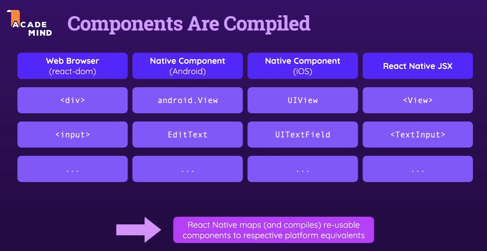

# Intro

## What is React Native?

- React Native는 그만의 코드를 사용해 React 코드와 Native API들을 연결해주는 것이라고 볼 수 있다.

## React Native 살펴보기

## React Native가 사용하는 컴포넌트와 각 Native 환경에 컴파일되는 형태

- Native 앱: Android 또는 iOS같은 구체적인 플랫폼만을 위해 만들어진 응용 프로그램을 네이티브 앱이라고 한다.

## React Native 앱에서 로직이 처리되는 방법

- JavaScript로 쓰인 로직들은 컴파일되지 않고, 앱 내에서 React Native가 관리하는 JavaScript thread에서 별도로 돌아간다.