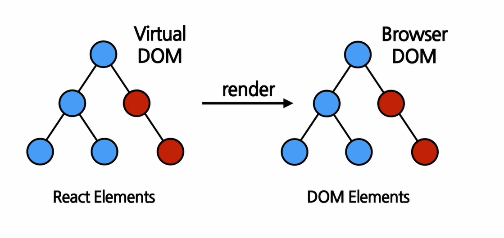
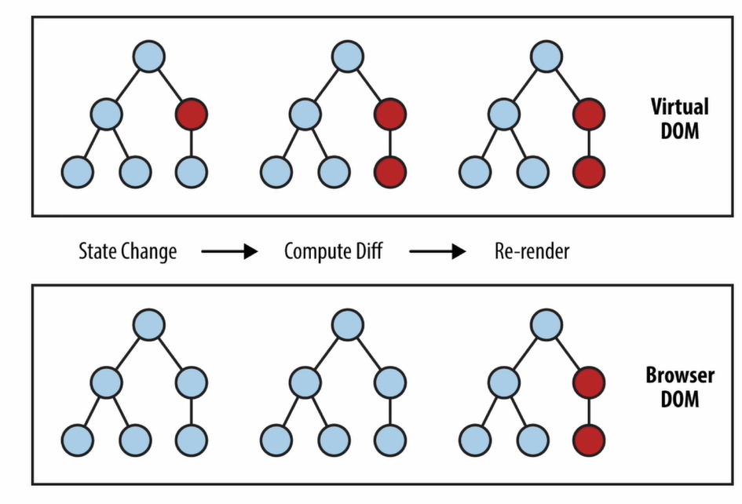

# Rendering Elements

## 1 Element란?

> The Smallest building blocks of React app



- React Elements: 가상 elements로, 실제 DOM element보다 가볍다. JS 객체 형태로 존재한다.

- createElement() 함수로 생성한다.

  ```react
  React.createElement(
  	type,
      [props],
      [...children]
  )
  ```

  

## 2. 특징

> 1. immutable(불변성)

Element 생성 후에는 children이나 attributes를 바꿀 수 없다.



- 원: Elements
- 빨간색 원: 갱신된 Element들


## 3. 렌더링

```react
<div id="root"></div>
```

- 모든 React element들이 이 최상위 element 아래서 렌더링된다.
- element의 불변성 때문에, 바꾸기 위해서는 매번 새롭게 렌더링해야 한다는 것이 중요하다.