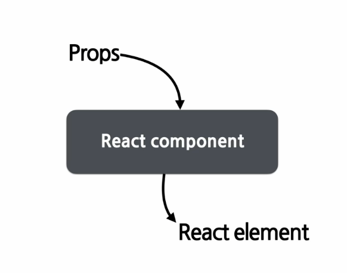

# Components and Props




## 컴포넌트 이름은 항상 대문자로 적는다

- 소문자로 적을 경우, HTML 요소로 인식되게 된다.


## Composition

복잡한 화면을 여러 개의 컴포넌트로 나눠 구성하여 재사용성을 높일 수 있다.

```react
function Welcome(props) {
    return <h1>Hello, {props.name}</h1>;
}

function App(props) {
    return (
        <div>
            <Welcome name="Mike" />
            <Welcome name="Steve" />
            <Welcome name="Jane" />
        </div>
    )
}

ReactDOM.render(
    <App />
    document.getElementById('root')
)
```