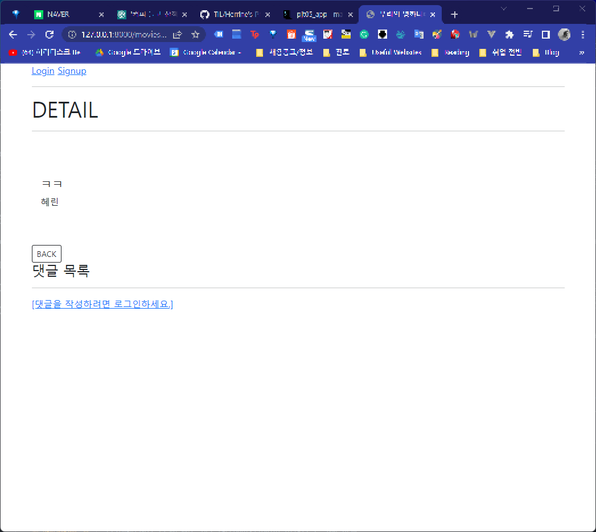

# README

## 개요

### - 프로젝트명

사용자 인증기반 관계형 DB 설계


### - 프로젝트 소개

- 데이터를 생성, 조회, 수정, 삭제할 수 있는 Web application 
- 게시판을 구현하여 사용자가 회원가입, 로그인 후 영화 정보 게시물을 등록하고 수정 삭제 할 수 있도록 한다.
- 사용자가 로그인 후 댓글을 등록, 삭제할 수 있게 한다.


### - 프로젝트 과정

- 우리 반 준우 오빠와 페어가 되어 Visual Studio Code의 'liveshare' 확장 프로그램을 통해 각각의 기능 구현을 UVT 패턴에 맞추어 번갈아 가면서 완성하는 방식으로 프로젝트를 진행했다.


## 실행방법

```bash
pip install requirements.txt
python manage.py runserver
```


## 프로젝트 결과

> http://127.0.0.1:8000/movies/


> http://127.0.0.1:8000/accounts/signup/


> http://127.0.0.1:8000/accounts/login/


> http://127.0.0.1:8000/movies/2/




## 과정별 느낀점

###  1. movies 앱

> urls.py

```python
from django.urls import path
from . import views

app_name = 'movies'

urlpatterns = [
    path('create/', views.create, name='create'),
    path('<int:pk>/', views.detail, name='detail'),
    path('<int:pk>/delete/', views.delete, name='delete'),
    path('<int:pk>/update/', views.update, name='update'),    
    path('', views.index, name='index'),
    path('<int:pk>/comments/', views.comment_create, name='comment_create'),
    path('<int:movie_pk>/comments/<int:comment_pk>/delete/', views.comment_delete, name='comment_delete'),
]
```


- 게시판 관련 url들을 적어준다.


> models.py

```python
from django.db import models
from django.conf import settings

# Create your models here.
class Movie(models.Model):
    user = models.ForeignKey(settings.AUTH_USER_MODEL, on_delete=models.CASCADE)
    title = models.CharField(max_length=20)
    description = models.TextField()

    def __str__(self):
        return self.title

class Comment(models.Model):
    movie = models.ForeignKey(Movie, on_delete=models.CASCADE)
    user = models.ForeignKey(settings.AUTH_USER_MODEL, on_delete=models.CASCADE)
    content = models.CharField(max_length=200)

    def __str__(self):
        return self.content
```


- 게시물과 댓글 관련 모델을 작성한다. 두 모델 모두 django의 user model을 참조하며 Comment와 Movie 데이터는 서로 N:1 관계를 가진다. 따라서 Comment model은 외래키로 movie id를 갖게 된다.


> forms.py

```python
from django import forms
from .models import Movie, Comment


class MovieForm(forms.ModelForm):

    class Meta:
        model = Movie
        fields = ('title', 'description',)


class CommentForm(forms.ModelForm):

    class Meta:
        model = Comment
        fields = ('content',)
```


- 게시물과 댓글을 입력할 수 있는 Django model form을 생성한다.


> views.py

```python
from django.contrib.auth.decorators import login_required
from django.shortcuts import render, redirect, get_object_or_404
from django.views.decorators.http import require_http_methods, require_POST, require_safe
from .models import Movie, Comment
from .forms import MovieForm, CommentForm

# Create your views here.
@require_safe
def index(request):
    movies = Movie.objects.order_by('-pk')
    context = {
        'movies': movies,
    }
    return render(request, 'movies/index.html', context)


@login_required
@require_http_methods(['GET', 'POST'])
def create(request):
    if request.method == 'POST':
        form = MovieForm(request.POST)
        if form.is_valid():
            movie = form.save(commit=False)
            movie.user = request.user
            movie.save()
            return redirect('movies:detail', movie.pk)
    else:
        form = MovieForm()
    context = {
        'form': form,
    }
    return render(request, 'movies/create.html', context)


@require_safe
def detail(request, pk):
    movie = get_object_or_404(Movie, pk=pk)
    comment_form = CommentForm()
    # 조회한 article의 모든 댓글을 조회(역참조)
    comments = movie.comment_set.all()
    context = {
        'movie': movie,
        'comment_form': comment_form,
        'comments': comments,
    }
    return render(request, 'movies/detail.html', context)


@require_POST
def delete(request, pk):
    movie = get_object_or_404(Movie, pk=pk)
    if request.user.is_authenticated:
        if request.user == movie.user:
            movie.delete()
    return redirect('movies:index')


@login_required
@require_http_methods(['GET', 'POST'])
def update(request, pk):
    movie = get_object_or_404(Movie, pk=pk)
    if request.user == movie.user:
        if request.method == 'POST':
            form = MovieForm(request.POST, instance=movie)
            if form.is_valid():
                movie = form.save()
                return redirect('movies:detail', movie.pk)
        else:
            form = MovieForm(instance=movie)
    else:
        return redirect('movies:index')
    context = {
        'movie': movie,
        'form': form,
    }
    return render(request, 'movies/update.html', context)


@require_POST
def comment_create(request, pk):
    if request.user.is_authenticated:
        movie = get_object_or_404(Movie, pk=pk)
        comment_form = CommentForm(request.POST)
        if comment_form.is_valid():
            comment = comment_form.save(commit=False)
            comment.movie = movie
            comment.user = request.user
            comment.save()
        return redirect('movies:detail', movie.pk)
    return redirect('accounts:login')


@require_POST
def comment_delete(request, movie_pk ,comment_pk):
    if request.user.is_authenticated:
        comment = get_object_or_404(Comment, pk=comment_pk)
        if request.user == comment.user:
            comment.delete()
    return redirect('movies:detail', movie_pk)
```


- 게시물과 댓글의 작업에 맞는 view 함수들을 작성한다.


> templates

```html
 create.html 
 detail.html 
 index.html 
 update.html 





  <h1>CREATE</h1>
  <hr>
  <form action="" method="POST" enctype="multipart/form-data">
    <div class="form-group">
      
      {{ form.as_p }}
      <button type="submit" class="btn btn-primary">Submit</button>
    </div>
  </form>
  <br>
  <a class="btn btn-outline-dark btn-sm" href="" role="button">
    BACK
  </a>







  <h1>DETAIL</h1>
  <hr>
  <div class="card border-0">
    <div class="card-body mb-5">
      <br>
      <br>
      <h5 class="card-title">
        {{ movie.title }}
      </h5>
      <p class="card-text">{{ movie.description}}</p>
      
        <a class="btn btn-warning btn-sm" href="" role="button">
          UPDATE
        </a>
        <br>
        <br>
        <form action="" method="POST">
          
          <input type="submit" value="DELETE">
        </form>
      
    </div>
  </div>
  <a class="btn btn-outline-dark btn-sm" href="" role="button">
    BACK
  </a>
  <h4>댓글 목록</h4>
  <ul>
    
      <li>
        {{ comment.user }} - {{ comment.content }}
        
          <form action="" method="POST">
            
            <input type="submit" value="삭제">
          </form>
        
      </li>
    
  </ul>
  <hr>
  
    <form action="" method="POST">
      
      {{ comment_form }}
      <input type="submit">
    </form>
  
    <a href="">[댓글을 작성하려면 로그인하세요.]</a>
  






  <h1 class="d-flex justify-content-center p-2 bg-info text-light">INDEX</h1>   
  <a href=""><button type="button" class="btn btn-primary">CREATE</button></a>  
  <table class="table tabel-dark table-striped">
    <thead>
      <tr>
        <th>작성자</th>
        <th>제목</th>        
      </tr>
    </thead>
    <tbody>     
      
      <tr>       
        <td>
          <a href="">
          {{movie.user}}
          </a>
        </td>      
        <td>{{movie.title}}</td>        
      </tr> 
           
    </tbody>
  </table>
  
 


<nav class="d-flex justify-content-center" aria-label="Page navigation example">
  <ul class="pagination">
    <li class="page-item"><a class="page-link" href="#">이전</a></li>
    <li class="page-item"><a class="page-link" href="#">1</a></li>
    <li class="page-item"><a class="page-link" href="#">2</a></li>
    <li class="page-item"><a class="page-link" href="#">3</a></li>
    <li class="page-item"><a class="page-link" href="#">다음</a></li>
  </ul>
</nav>







  <h1>UPDATE</h1>
  <hr>
  <form action="" method="POST">
    
    {{ form.as_p }}
    <input type="submit">
  </form>
  <a href="">back</a>

```


- create.html에서는 게시물 내용을 작성하고 POST 요청을 통해 등록하는 form 태그와 그 안의 submit button 요소를 작성했다. 맨 밑에는 index 페이지로 이동하는 button 요소를 추가했다.
- detail.html에서는 특정 pk의 게시물과 거기에 달린 댓글들을 모두 출력해줘야 한다. card 형식으로 게시물을 출력한 후, 밑에는 user 일치 여부를 확인하는 if 문 안에 update와 delete button 요소를 넣어준다. 역시 index 페이지로 이동하는 button도 넣어준다. 그 밑에는 for문을 이용해 댓글 목록을 모두 출력한다. 그리고 user 일치 여부를 확인하는 if문 안에 delete button 요소를 추가한다. 마지막으로 user가 로그인 상태(if request.user.is_authenticated)이면 댓글을 작성할 수 있는 input 요소를 보여주고, 아니라면 login url로 이동시켜주는 링크를 보여준다.

- index.html은 메인 화면이다. for문을 사용해 글을 반복적으로 보여주고, 맨 위에는 create button 요소를 추가한다. 하단에는 pagination을 추가하여 가독성을 좋게 한다.
- update.html은 수정 버튼 클릭시 나오는 화면이다. 기존의 내용을 담은 form과 submit button을 적어준다.


> base.html

```html
<!DOCTYPE html>
<html lang="en">
<head>
  <meta charset="UTF-8">
  <meta http-equiv="X-UA-Compatible" content="IE=edge">
  <meta name="viewport" content="width=device-width, initial-scale=1.0">
  <link href="https://cdn.jsdelivr.net/npm/bootstrap@5.1.3/dist/css/bootstrap.min.css" rel="stylesheet" integrity="sha384-1BmE4kWBq78iYhFldvKuhfTAU6auU8tT94WrHftjDbrCEXSU1oBoqyl2QvZ6jIW3" crossorigin="anonymous">
  <title>우리의 영화나라</title>
</head>
<body>
  <div class="container">
    
    <h3>Hello, {{ user }}</h3>
    <form action="" method="POST">
      
      <input type="submit" value="Logout">
    </form>
    <a href="">회원정보수정</a>
    <form action="" method="POST">
      
      <input type="submit" value="회원탈퇴">
    </form>
    
      <a href="">Login</a>
      <a href="">Signup</a>
    
    <hr>

    
    
  </div>
  <script src="https://cdn.jsdelivr.net/npm/bootstrap@5.1.3/dist/js/bootstrap.bundle.min.js" integrity="sha384-ka7Sk0Gln4gmtz2MlQnikT1wXgYsOg+OMhuP+IlRH9sENBO0LRn5q+8nbTov4+1p" crossorigin="anonymous"></script>
</body>
<footer></footer>
</html>
```


- login 돼 있을 시 회원정보 수정 버튼을, 그렇지 않을 시 login과 signup 링크로 이동시키는 button 요소를 보여주도록 설정하고, bootstrap cdn을 가져온다.


### 2. accounts 앱

> urls.py

```python
from django.urls import path
from . import views

app_name = 'accounts'

urlpatterns = [
    path('login/', views.login, name='login'),
    path('logout/', views.logout, name='logout'),
    path('signup/', views.signup, name='signup'),
    path('update/', views.update, name='update'),
    path('delete/', views.delete, name='delete'),
    path('password/', views.change_password, name='change_password'),    
]
```


- 로그인, 로그아웃, 회원가입, 회원정보 수정, 회원탈퇴, 비밀번호 변경을 가능하게 하는 url들을 각각 적어주었다.


> views.py

```python
from django.shortcuts import render, redirect
from django.contrib.auth import login as auth_login
from django.contrib.auth import logout as auth_logout
from django.contrib.auth import update_session_auth_hash
from django.contrib.auth.decorators import login_required
from django.views.decorators.http import require_http_methods, require_POST
from django.contrib.auth.forms import AuthenticationForm, PasswordChangeForm
from .forms import CustomUserCreationForm, CustomUserChangeForm
# Create your views here.
@require_http_methods(['GET', 'POST'])
def login(request):
    if request.user.is_authenticated:
        redirect('movies:index')

    if request.method == 'POST':
        form = AuthenticationForm(request, request.POST)
        if form.is_valid():
            #로그인
            auth_login(request, form.get_user())
            return redirect(request.GET.get('next') or 'movies:index')
    else: 
        form = AuthenticationForm()
    context = {
        'form': form,
    }
    return render(request, 'accounts/login.html', context)

@require_POST
def logout(request):
    if request.user.is_authenticated:
        auth_logout(request)
    return redirect('movies:index')

@require_http_methods(['GET', 'POST'])
def signup(request):
    if request.method == 'POST':
        form = CustomUserCreationForm(request.POST)
        if form.is_valid():
            user = form.save()
            auth_login(request, user)
            return redirect('movies:index')
    else:
        form = CustomUserCreationForm()
    context = {
        'form': form,
    }
    return render(request, 'accounts/signup.html', context)

@login_required
@require_http_methods(['GET', 'POST'])
def update(request):
    if request.method == 'POST':
        form = CustomUserChangeForm(request.POST, instance=request.user)
        if form.is_valid():
            form.save()
            return redirect('movies:index')
    else:
        form = CustomUserChangeForm(instance=request.user)
    context = {
        'form': form,
    }
    return render(request, 'accounts/update.html', context)

@require_POST
def delete(request):
    if request.user.is_authenticated:
        request.user.delete()
        auth_logout(request)
    return redirect('movies:index')

@login_required
@require_http_methods(['GET', 'POST'])
def change_password(request):
    if request.method == 'POST':
        form = PasswordChangeForm(request.user, request.POST)
        if form.is_valid():
            user = form.save()
            update_session_auth_hash(request, user)
            return redirect('movies:index')
    else:
        form = PasswordChangeForm(request.user)
    context = {
        'form': form,
    }
    return render(request, 'accounts/change_password.html', context)

```


> models.py

```python
from django.db import models
from django.contrib.auth.models import AbstractUser

# Create your models here.
class User(AbstractUser):
    pass
```


- django의 내장 User model을 상속받아 정의해준다.


> forms.py

```python
from django.contrib.auth.forms import UserCreationForm, UserChangeForm
from django.contrib.auth import get_user_model

class CustomUserCreationForm(UserCreationForm):

    class Meta(UserCreationForm.Meta):
        model = get_user_model()
        fields = UserCreationForm.Meta.fields

class CustomUserChangeForm(UserChangeForm):

    class Meta(UserChangeForm.Meta):
        model = get_user_model()
        fields = ('first_name', 'last_name',)
```


- 회원가입 및 회원정보 수정이 가능한 form들을 django로부터 상속받아 재정의한다. 회원정보 수정에서는 이름만 수정 가능하도록 fields를 수정한다.


> templates

1. change_password
2. login
3. signup
4. update

```html



  <h1>비밀번호변경</h1>
  <hr>
  <form action="" method="POST">
    
    {{ form.as_p }}
    <input type="submit">
  </form>
  <a href="">BACK</a>






  <h1>로그인</h1>
  <hr>
  <form action="" method="POST"> 
    
    {{ form.as_p }}
    <input type="submit">
  </form>
  <a href="">BACK</a>






  <h1>회원가입</h1>
  <hr>
  <form action="" method="POST">
    
    {{ form.as_p }}
    <input type="submit">
  </form>
  <a href="">BACK</a>






  <h1>회원정보수정</h1>
  <hr>
  <form action="" method="POST">
    
    {{ form.as_p }}    
    <input type="submit">
  </form>
  <a href="">BACK</a>

```


- change_password.html에서는 비밀번호 수정 form을 정의해 놓았던 것을 사용자에게 보여주고, submit button을 통해 전송하도록 하면 된다.

- login.html에서는 login form을 보여주고 submit button을 통해 전송하도록 한다.

- signup.html에서는 회원가입 form을 보여주고 submit button을 통해 전송하도록 한다.
- update.html에서는 기존의 내용을 담은 회원정보 form을 정해진 field들만 출력하고, 수정 후 submit button을 통해 전송하도록 한다.


### 3. 느낀 점

- 처음에는 두 개의 app을 만들어야 한다는 점이 부담으로 다가왔다. 하지만 app은 기능별로 분리되어 있는 의미상의 구분일 뿐이고, 내가 해야 하는 것은 url 작성 - 기능별 필요한 view 함수 및 form, model form 작성 - 이 모든 것을 template에서 필요한 부분에 가져다가 쓰는 것이라고 생각하면서 좀 더 차분하게 프로젝트를 진행할 수 있었던 것 같다.
- 처음보다 UVT 패턴을 잘 지켜가면서 개발하게 되면서 오류도 줄고, 속도도 빨라진 것 같아 뿌듯했다.