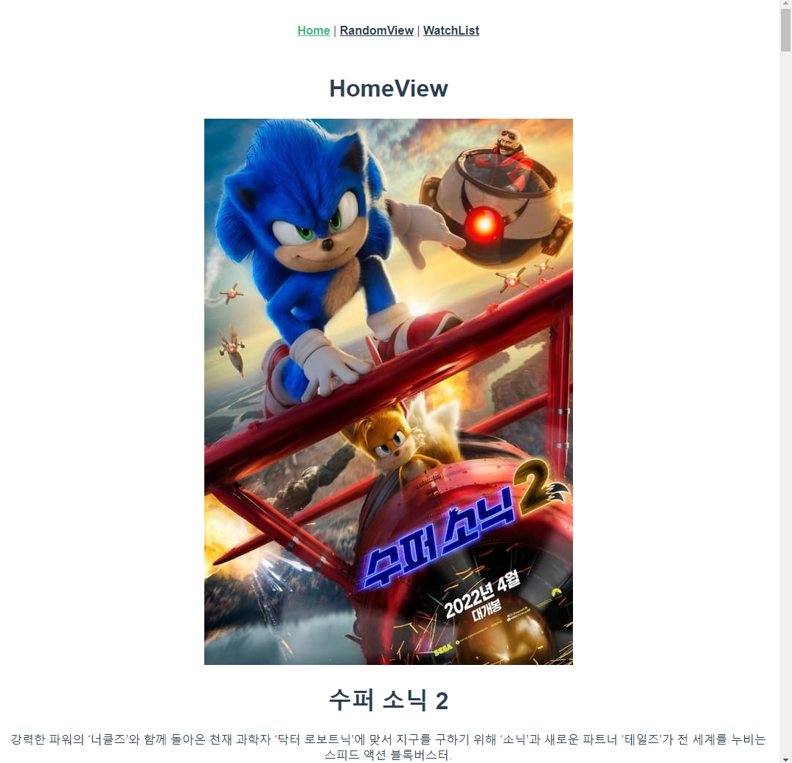
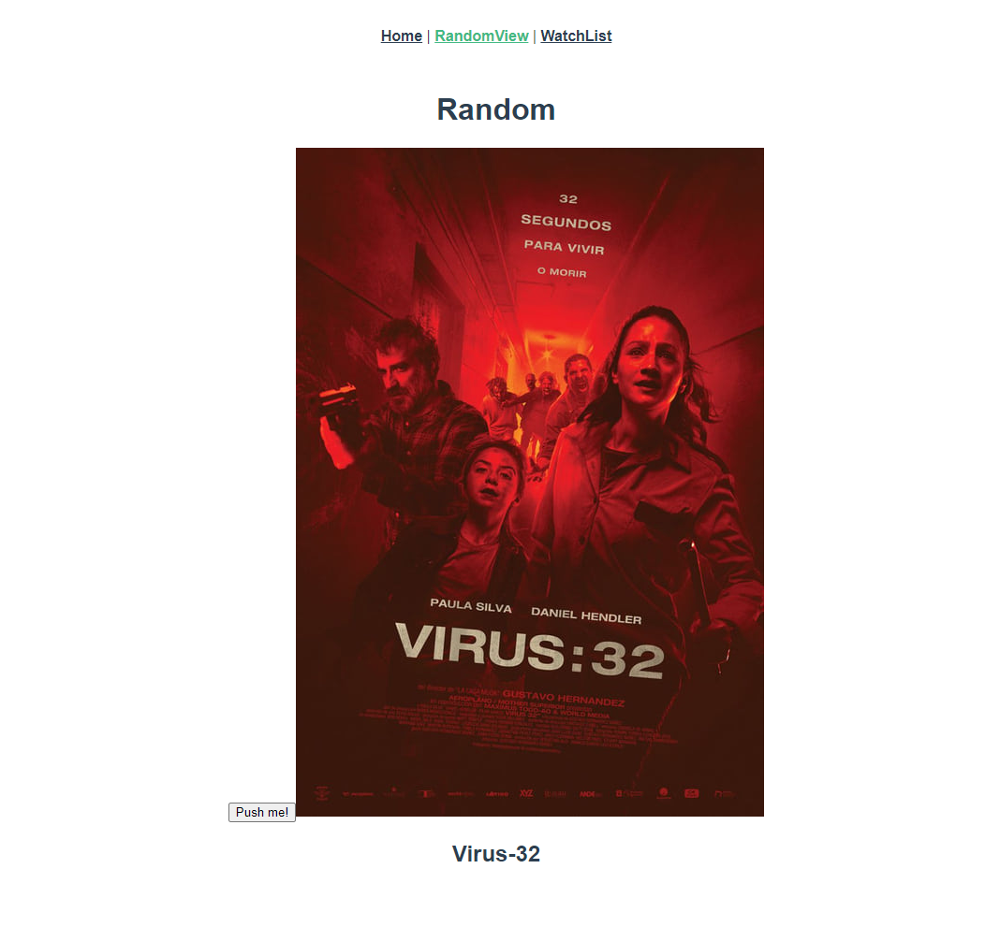
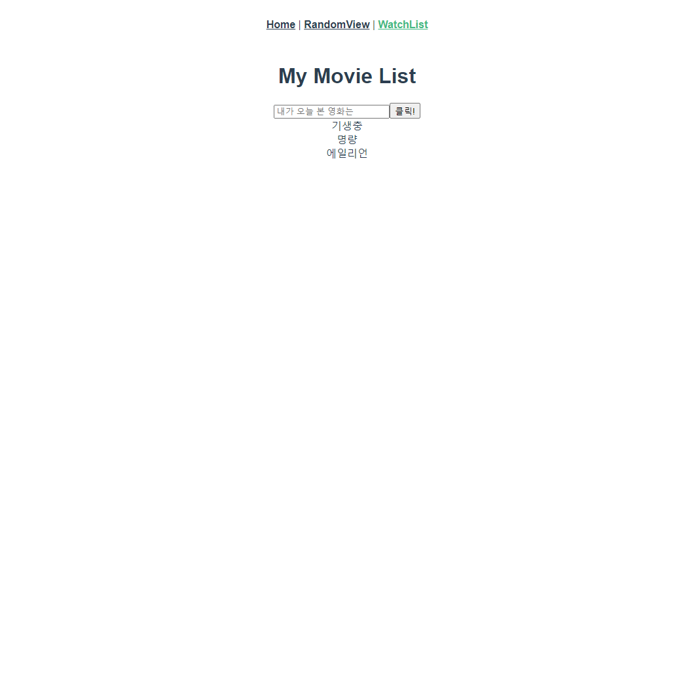

# pjt10

## Project setup
```
npm install
```

### Compiles and hot-reloads for development
```
npm run serve
```

### Compiles and minifies for production
```
npm run build
```

### Lints and fixes files
```
npm run lint
```

### Customize configuration
See [Configuration Reference](https://cli.vuejs.org/config/).


## 개요

### - 프로젝트명

Vue를 활용한 SPA 구성


### - 프로젝트 소개

Vuex, Router, AJAX 통신, TMDB API를 이용한 영화 정보, 영화 추천, 직접 추가하는 영화 리스트 기능을 구현한다.


### - 프로젝트 과정

같은 반 찬영오빠와 페어 프로그래밍을 진행했다. Visual Studio Code의 liveshare 프로그램을 이용해 각 페이지를 번갈아가며 구현했다.


## 프로젝트 결과

> http://localhost:8080/




> http://localhost:8080/random-view




> http://localhost:8080/watch-list




## 과정별 느낀점

> Home

1. App.vue에 router-link 태그로 RandomView와 WatchList 경로를 추가해 메뉴를 만든다. Homeview는 따로 경로 이름은 없고 home path를 그대로 활용한다.
2. created function을 통해 movieCardGet action을 호출하여 TMDB API로 axios 요청을 보낸다. mutation은 MovieCards state에 영화 리스트들을 담아준다. state가 업데이트 되었으므로 계속 여기에서 영화 데이터들을 꺼내쓸 수 있게 되었다.
3. HomeView에서 mapState로 MovieCards 리스트를 가져오고 MovieCard.vue 컴포넌트를 import 해준다. 그 후 movie-card 태그 안에 v-for 디렉티브로 반복 표시하고 MovieCard.vue에 prop으로 넘겨준다.
4. MovieCard.vue에서 MovieCard의 형태만 만들면 Home 작업이 끝난다. 포스터 img, 제목, 줄거리 정보를 props 데이터로부터 가져온다.


> Random

1. RandomView.vue에서 전부 구현한다. v-on 메서드를 사용해 랜덤한 영화 데이터를 가져올 버튼을 만든다.
2. computed에서 mapState를 통해 MovieCards 데이터를 가져온다. 
3. methods에서 랜덤으로 하나의 MovieCard를 가져오는 함수를 만든다.
4. data에 title, poster path를 저장한다.

5. img 태그와 h2 태그에 data 정보를 저장한다.
