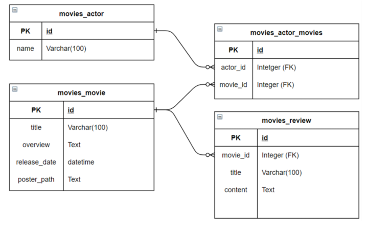

# pjt08 


## 1. 프로젝트 개요

### 1) 목표

- DRF(Django Rest Framework)를 활용한 API Server 제작
- Database 1:N, M:N에 대한 이해


### 2) 요구사항

- 영화의 배우 데이터, 영화 데이터, 리뷰 데이터 조회 및 리뷰 데이터 생성/수정/삭제가 가능하도록 해야 한다.
- ERD




### 3) 개발 과정 및 느낀 점


> models.py

```python
from django.db import models
from django.forms import CharField

# Create your models here.
class Actor(models.Model):
    name = models.CharField(max_length=100)

class Movie(models.Model):
    title = models.CharField(max_length=100)
    overview = models.TextField()
    release_date = models.DateTimeField()
    poster_path = models.TextField()
    actors = models.ManyToManyField(Actor, related_name='movies')

class Review(models.Model):
    title = models.CharField(max_length=100)
    content = models.TextField()
    movie = models.ForeignKey(Movie, on_delete=models.CASCADE)
```

- 배우, 영화, 리뷰 데이터 각각에서 필요한 필드들을 정의한다. 이 때, Movie와 Actor는 서로 M:N 관계를 가지고 있고, Movie와 Review는 1:N 관계를 가지는 것에 주의하여 정의한다.


> serializers

- actor.py

  ```python
  from rest_framework import serializers
  from ..models import Actor, Movie
  
  class MovieSerializer(serializers.ModelSerializer):
      
      class Meta:
          model = Movie
          fields = ('title',)
  
  class ActorListSerializer(serializers.ModelSerializer):
  
      class Meta:
          model = Actor
          fields = '__all__'
  
  class ActorSerializer(serializers.ModelSerializer):
      movies = MovieSerializer(many=True, read_only=True)
  
      class Meta:
          model = Actor
          fields = ('id', 'movies', 'name')
  ```

  - 출력되는 movie 필드를 커스터마이징 하기 위해 MovieSerializer를 맨 위에 새로 정의해준다.


- movie.py

  ```python
  from rest_framework import serializers
  from ..models import Movie, Actor, Review
  
  class ActorSerializer(serializers.ModelSerializer):
  
      class Meta:
          model = Actor
          fields = ('name',)
  
  class ReviewSerializer(serializers.ModelSerializer):
  
      class Meta:
          model = Review
          fields = ('title', 'content',)
  
  class MovieListSerializer(serializers.ModelSerializer):
  
      class Meta:
          model = Movie
          fields = ('title', 'overview',)
  
  
  class MovieSerializer(serializers.ModelSerializer):
      actors = ActorSerializer(many=True, read_only=True)
      review_set = ReviewSerializer(many=True, read_only=True)
  
      class Meta:
          model = Movie
          fields = '__all__'
  ```


- review.py

  ```python
  from rest_framework import serializers
  from ..models import Review, Movie
  
  class MovieSerializer(serializers.ModelSerializer):
  
      class Meta:
          model = Movie
          fields = ('title',)
  
  class ReviewListSerializer(serializers.ModelSerializer):
      movies = MovieSerializer(many=True, read_only=True)
      class Meta:
          model = Review
          fields = ('title', 'content', 'movies')
  
  class ReviewSerializer(serializers.ModelSerializer):
      movie = MovieSerializer(read_only=True)
  
      class Meta:
          model = Review
          fields = ('id', 'movie', 'title', 'content',)
          read_only_fields = ('movie',)
  ```


> urls.py

```python
from django.urls import path
from . import views

app_name = 'movies'

urlpatterns = [
    path('movies/', views.movie_list),
    path('movies/<int:movie_pk>/', views.movie_detail),
    path('movies/<int:movie_pk>/reviews/', views.review_create),
    path('reviews/', views.review_list),
    path('reviews/<int:review_pk>/', views.review_detail),
    path('actors/', views.actor_list),
    path('actors/<int:actor_pk>/', views.actor_detail)
]
```


> views.py

```python
from django.shortcuts import get_list_or_404, get_object_or_404
from rest_framework.decorators import api_view
from rest_framework.response import Response

from movies.serializers.actor import ActorSerializer, ActorListSerializer
from .serializers.movie import MovieListSerializer, MovieSerializer
from .serializers.review import ReviewListSerializer, ReviewSerializer
from .models import Movie, Actor, Review
from rest_framework import status

# Create your views here.
@api_view(['GET'])
def movie_list(request):
    movies = get_list_or_404(Movie)
    serializer = MovieListSerializer(movies, many=True)
    return Response(serializer.data)

@api_view(['GET'])
def movie_detail(request, movie_pk):
    movie = get_object_or_404(Movie, pk=movie_pk)
    serializer = MovieSerializer(movie)
    return Response(serializer.data)

@api_view(['POST'])
def review_create(request, movie_pk):
    movie = get_object_or_404(Movie, pk=movie_pk)
    serializer = ReviewSerializer(data=request.data)
    if serializer.is_valid(raise_exception=True):
        serializer.save(movie=movie)
        return Response(serializer.data, status=status.HTTP_201_CREATED)

@api_view(['GET'])
def review_list(request):
    reviews = get_list_or_404(Review)
    serializer = ReviewListSerializer(reviews, many=True)
    return Response(serializer.data)

@api_view(['GET', 'DELETE', 'PUT'])
def review_detail(request, review_pk):
    review = get_object_or_404(Review, pk=review_pk)
    
    if request.method == 'GET':
        serializer = ReviewSerializer(review)
        return Response(serializer.data)

    elif request.method == 'DELETE':
        review.delete()
        data = {
            'delete': f'review {review_pk} is deleted'
        }
        return Response(data, status=status.HTTP_204_NO_CONTENT)

    elif request.method == 'PUT':
        serializer = ReviewSerializer(review, request.data)
        if serializer.is_valid(raise_exception=True):
            serializer.save()
            return Response(serializer.data)

@api_view(['GET'])
def actor_list(request):
    actors = get_list_or_404(Actor)
    serializer = ActorListSerializer(actors, many=True)
    return Response(serializer.data)

@api_view(['GET'])
def actor_detail(request, actor_pk):
    actor = get_object_or_404(Actor, pk=actor_pk)
    serializer = ActorSerializer(actor)
    return Response(serializer.data)
```


#### 느낀 점

- 외래키, 1:N, M:N 등 DB의 관계를 잘 정립하는 것이 중요하다는 것을 제대로 느꼈던 프로젝트 

- serializer를 새롭게 상속받아야 참조 에러가 나지 않는다는 중요한 배움