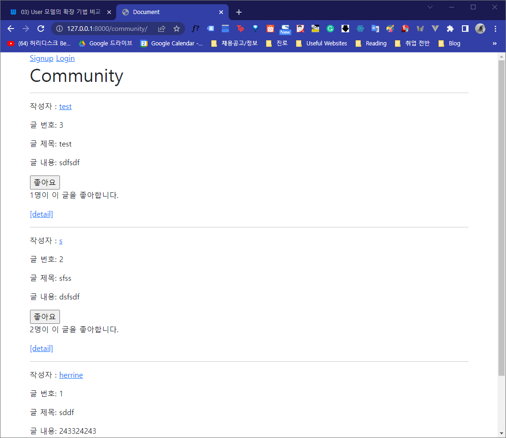
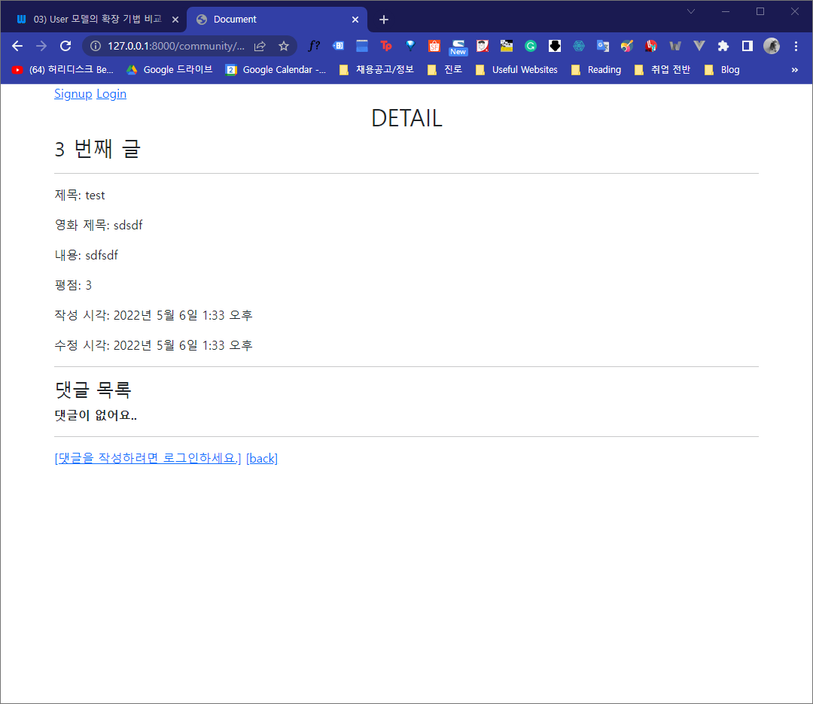
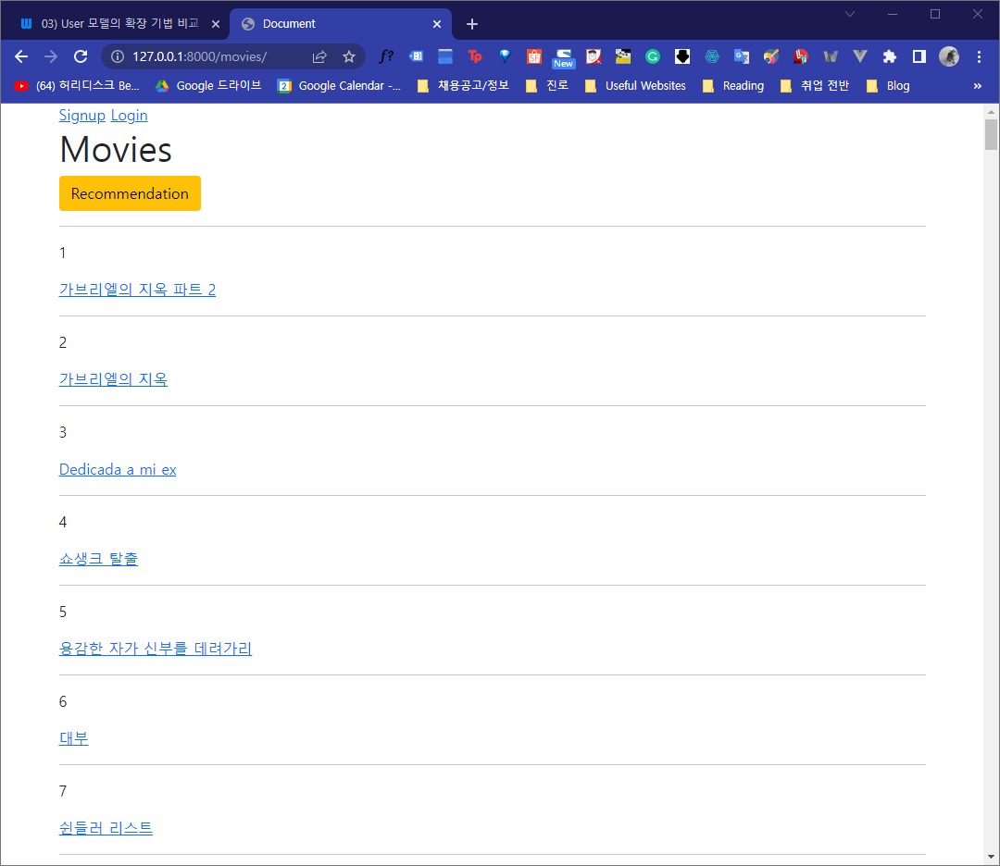
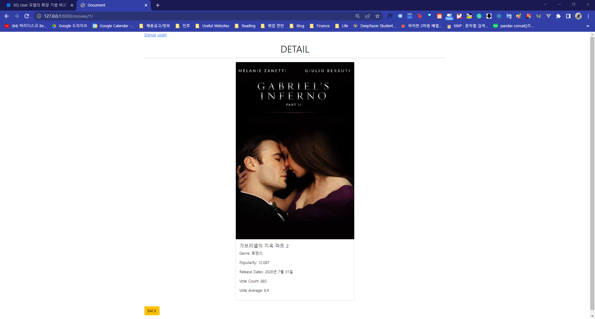

# README

## 개요

### - 프로젝트명

알고리즘을 적용한 서버 구성


### - 프로젝트 소개

- community app을 통해 글을 등록, 삭제, 수정, 조회할 수 있는 게시판 기능을 구현한다.
- accounts app을 통해 회원가입, 탈퇴, 회원정보 수정, 로그인 기능을 구현한다.

- movies app에서 TMDB API를 이용해 평점이 높은 영화 목록을 보여주는 페이지와 영화 한 개를 추천해주는 기능을 구현한다.


### - 프로젝트 과정

같은 반 선영이와 페어 프로젝트를 진행했다. Visual Studio Code의 liveshare 프로그램을 이용해 각 기능을 번갈아 가며 구현하는 방식으로 페어 프로그래밍을 진행했다.


## 설치방법

```bash
pip install -r requirements.txt
python manage.py runserver
```


## 프로젝트 결과

> http://127.0.0.1:8000/community/




> http://127.0.0.1:8000/community/3/




> http://127.0.0.1:8000/movies/




> http://127.0.0.1:8000/movies/1/



## 과정별 느낀점


### 1. movies app

> recommended view 함수

```python
@require_safe
def recommended(request):
    popular_movies = Movie.objects.order_by('-popularity')[:10]
    context = {
        'popular_movies': popular_movies
    }
    return render(request, 'movies/recommended.html', context)
```


- http://127.0.0.1:8000/movies/ movies app 메인 화면에서 보여줄 추천 목록을 TMDB API에서 받아 온 인기 영화들을 popularity 점수에 따라 내림차순으로 나열한 뒤 상위 10개를 보여주는 방식으로 알고리즘을 구성했다.


> tempaltetags

templatetags 기능을 새롭게 배웠다. templatags 파일에 .py 파일을 만들어 템플릿에서 사용할 수 있는 '커스텀 태그'를 만들 수 있다. 디렉토리 명은 고정되어 있으며, module 명은 다른 것들과 중복되지 않게 만들도록 한다. 위치에 상관 없이 module 명으로 load 되기 때문이다.


```python
# templatetags/movie_detail.py

from django import template

register = template.Library()

@register.filter
def make_genre_list(genres):
    return ', '.join([genre.name for genre in genres])
```

```html



<br>
  <h1 class="d-flex justify-content-center">DETAIL</h1>
  <hr>
  <div class="d-flex justify-content-center">
    <div class="card" style="width: 32rem;">
      
      <div class="card-body ">
        <h5 class="card-text">{{ movie.title }}</h5>
        
        <p>Genre: {{ genres|make_genre_list }}</p>
        <p class="card-text">Popularity: {{ movie.popularity }}</p>
        <p class="card-text">Release Dates: {{ movie.release_date }}</p>
        <p class="card-text">Vote Count: {{ movie.vote_count }}</p>
        <p class="card-text">Vote Average: {{ movie.vote_average }}</p>
        <p class="card-text">{{ movie.overview }}</p>

      </div>
    </div>
  </div>
  <br>
  <a href="" class="btn btn-warning">BACK</a>
  <br>
  <hr>


```


- fixture로 제공된 JSON 파일로부터 genre 이름을 가져왔을 때, 쉼표가 포함되는 문제를 해결하기 위해 join 함수를 사용한 module을 따로 지정하고, template에서 파일명을 load하여 DTL과 동일한 방식으로 사용했다.


### 2. community app

기존 게시판 기능들과 같은 기능을 가지고 있지만, 좋아요 기능이 추가된 형태의 app이다.


> 좋아요 기능

```python
# views.py

@require_POST
def like(request, review_pk):
    if request.user.is_authenticated:
        review = get_object_or_404(Review, pk=review_pk)
        user = request.user

        if review.like_users.filter(pk=user.pk).exists():
            review.like_users.remove(request.user)
            is_liked = False
        else:
            review.like_users.add(request.user)
            is_liked = True

        context = {
            'is_liked': is_liked,
            'like_count': review.like_users.count()
        }
        return JsonResponse(context)
    return redirect('accounts:login')

```

- view 함수에서  좋아요 여부와 좋아요 개수를 JsonResponse로 template에 넘겨준다.

- JsonResponse란: HttpResponse의 subclass로, JSON-encoded response를 생성할 수 있게 해준다.


```html



  <h1>Community</h1>
  <hr>
  
    <p>작성자 : <a href="">{{ review.user }}</a></p>
    <p>글 번호: {{ review.pk }}</p>
    <p>글 제목: {{ review.title }}</p>
    <p>글 내용: {{ review.content }}</p>
    <form class="likeForm d-inline" data-review-id="{{ review.pk }}">
      
      
        <input type="submit" data-review-id="{{ review.pk }}" id="like-{{ review.pk }}" value="좋아요 취소"></input>
      
        <input type="submit" data-review-id="{{ review.pk }}" id="like-{{ review.pk }}" value="좋아요"></input>
      
    </form>
    <p id="like-count-{{ review.pk }}">{{ review.like_users.all|length }}명이 이 글을 좋아합니다.</p>
    <a href="">[detail]</a>
    <hr>
  



<script>
  const forms = document.querySelectorAll('.likeForm')
  forms.forEach( form=> {
    form.addEventListener('click', function(event) {
      event.preventDefault()
      
      const reviewId = event.target.dataset.reviewId
      const URL = `/community/${reviewId}/like/`
      const csrftoken = document.querySelector('[name=csrfmiddlewaretoken]').value
    
      axios({
        method: 'post',
        url: URL,
        headers: {'X-CSRFToken': csrftoken}
      })
        .then(response => {
          const isLiked = response.data.is_liked
          const likeCount = response.data.like_count

          const button = document.querySelector(`#like-${reviewId}`)
          button.value = isLiked ? '좋아요 취소' : '좋아요'

          const countText = document.querySelector(`#like-count-${reviewId}`)
          countText.innerText = `${likeCount}명이 이 글을 좋아합니다.`
        })
        .catch(error => {
          if (error.response.status === 401) {
            window.location.href = '/accounts/login/'
          } else {
            console.log(error)
          }
        })
    })
  })
</script>

```

- index.html에서 JavaScript AJAX 요청을 보내 좋아요와 관련된 일부 기능만 바꾸어 주는 것이 프로젝트의 핵심 목표였다.
- 사용자가 좋아요 버튼을 눌렀을 때 views.py로 axios 요청을 보낸다. views.py에서는 DB를 확인해 좋아요가 이미 되어 있으면 좋아요를 누른 사람을 DB에서 삭제하고, 되어있지 않다면 DB에 추가하고 좋아요 상태를 응답해준다.
- 다시 index.html로 돌아와서, 응답에 맞게 button 안의 text를 수정하고 좋아요의 개수도 새로 갱신해준다.


### 3. accounts app

기존의 로그인, 회원가입 기능과 동일하지만, follow와 profile 기능이 추가되었다.

> views.py

```python
@login_required
def profile(request, username):
    person = get_object_or_404(get_user_model(), username=username)
    context = {
        'person': person,
    }
    return render(request, 'accounts/profile.html', context)


@require_POST
def follow(request, user_pk):
    if request.user.is_authenticated:
        person = get_object_or_404(get_user_model(), pk=user_pk)
        user = request.user
        if person != user:
            if person.followers.filter(pk=user.pk).exists():
                person.followers.remove(user)
                is_follow = False
            else:
                person.followers.add(user)
                is_follow = True
                
            context = {
                'is_follow' : is_follow,
                'followersCount' : person.followers.count(),
                'followingsCount' : person.followings.count()
            }
            return JsonResponse(context)
    return redirect('accounts:login')
```

- profile 함수에서는 username 정보를 profile.html로 보내준다.
- follow 함수에서는 팔로우를 시도한 대상이 본인이 아니라면 팔로우/언팔로우를 진행하고, 팔로우 여부와 follower, following 수를 갱신하여 JsonResponse에 context로 넘겨준다.


> profile.html

```html



  <h1>{{ person.username }}의 프로필 페이지</h1>
  
    <div>
      <div>
        팔로워 : <span id="followersCountText">{{ followers|length }}</span> / 팔로우 : <span id="followingsCountText">{{ followings|length }}</span>
      </div>
      
        <div>
          <form action="" method="POST">
            
            
              <button id="followButton" data-user-id="{{ person.pk }}">언팔로우</button>
            
              <button id="followButton" data-user-id="{{ person.pk }}">팔로우</button>
            
          </form>
        </div>
      
    </div>
  
  




<script>
  const followButton = document.querySelector('#followButton')
  followButton.addEventListener('click', function(event) {
    event.preventDefault()
    const userId = event.target.dataset.userId
    const URL = `/accounts/${userId}/follow/`
    const csrftoken = document.querySelector('[name=csrfmiddlewaretoken]').value
    axios({
      method: 'post',
      url: URL, 
      headers: {'X-CSRFToken': csrftoken}
    })
    .then( response => {
      console.log(response)
      //
      const { isFollow, followingsCount, followersCount } = response.data
      event.target.innerText = isFollow ? '언팔로우' : '팔로우'
      document.querySelector('#followingsCountText').innerText = followingsCount
      document.querySelector('#followersCountText').innerText = followersCount
    })
  })
  
</script>

```

- 좋아요 기능과 같은 방식으로 script 태그 부분을 작성한다.


### 4. 느낀 점

- axios 요청을 작성하면서 헷갈리는 부분이 많아서 교수님 코드를 참고했는데, event.preventDefault() 부분이 빠져 있는 것을 몰라서 헤멨다. 코드를 외우지 않으려고 해도 어떤 부분들은 무의식중에 자꾸 암기하게 되는 것 같은데, 코드 한 줄 한 줄의 작동 방식을 정확히 알아야 이런 일이 다시 없을 것 같다.
- 웹페이지를 다시 로드하지 않고도 일부분만 수정할 수 있는 axios를 직접 활용해본 점이 가장 재미있었다. 이제 내가 사용하는 웹사이트들이 어떻게 동작하는지 잘 알게 되어가는 것 같다.