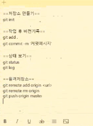

# git

> 분산버전관리시스템(DVCS)

- Git: 버전 관리 시스템
- Github: 포트폴리오

```bash
$ mkdir testFolder
$ ls # 목록 보기
$ rmdir testFolder
$ cd "디렉토리 주소 복사한 것" # 경로 변경

$ touch a.txt
$ pwd # 현재 작업 위치
$ cd .. # 상위 디렉토리로 이동
$ rm -rf 디렉토리명 # 디렉토리와 하위의 모든 파일까지 삭제

```


## 1. git 저장소 만들기 (init)

> Create an empty Git repository or reinitialize an existing one

```bash
$ git init
Initialized empty Git repository in C:/Users/takhe/Desktop/first/.git/
(master) $
```

* `.git` 폴더가 생성 => 버전이 기록되는 저장소 
  * 해당 폴더를 지우게 되면 모든 버전이 삭제되니 주의!
* `(master)` 

## 2. 버전 기록하기

### add

>  Add file contents to the index

```bash
$ git add 파일명 
$ git add a.txt
$ git add my_folder/
$ git add a.txt b.txt
```

###  commit

> Record changes to the repository

````bash
$ git commit -m '커밋메시지'
````

* 커밋 메시지는 항상 버전의 내용(변경사항)에 대해서 나타낼 수 있도록 기록한다.
* 

## status

> Show the working tree status

```bash
$ git status
```

```bash
$ git status

# 커밋할 변경사항들 (Staging area)
Changes to be committed:
  (use "git restore --staged <file>..." to unstage)
        deleted:    b.txt

# 커밋을 위해 준비되지 않은 변경사항 (Staging area X => Working directory)
Changes not staged for commit:
  (use "git add <file>..." to update what will be committed)
  (use "git restore <file>..." to discard changes in working directory)
        modified:   a.txt

# 트래킹되지 않은 파일들 (Working directory)
Untracked files:
  (use "git add <file>..." to include in what will be committed)
        c.txt

```

* 파일을 조작을 하는 방법이 4가지?

  * 생성 Create
  * ~~읽기 Read~~ 
  * 수정 Update
  * 삭제 Delete

  ```bash
  $ git status
  On branch master
  Changes to be committed:
    (use "git restore --staged <file>..." to unstage)
          deleted:    b.txt
          new file:   c.txt
  
  Changes not staged for commit:
    (use "git add <file>..." to update what will be committed)
    (use "git restore <file>..." to discard changes in working directory)
          modified:   a.txt
  ```

## log

>  Show commit logs

```bash
$ git log
```


## 3. git 파일의 라이프 사이클

[관련 문서 - Git 기초](https://git-scm.com/book/ko/v2/%EC%8B%9C%EC%9E%91%ED%95%98%EA%B8%B0-Git-%EA%B8%B0%EC%B4%88)

[관련 문서 - Git 수정하고 저장소에 저장하기](https://git-scm.com/book/ko/v2/Git%EC%9D%98-%EA%B8%B0%EC%B4%88-%EC%88%98%EC%A0%95%ED%95%98%EA%B3%A0-%EC%A0%80%EC%9E%A5%EC%86%8C%EC%97%90-%EC%A0%80%EC%9E%A5%ED%95%98%EA%B8%B0)


## git에서 관리하는 파일 변경사항 상태

* untracked : 커밋에 포함된 적 없는 파일
* tracked 
  * modified : 커밋에 비해서 수정된 경우
  * staged : 커밋 되기 전 목록 (Staging area)
  * commited : 커밋된 상태

모든 커밋된 파일은 되살릴 수 있으나, 아니면 불가능하다


- 검은 부분은 물리적인 공간이 아니기 때문에 restore 지점을 지정하거나 할 수 있는 것은 아니다. 교류 불가능.

https://learngitbranching.js.org/?locale=ko

`$ git` 치면 명령어 거의 대부분 볼 수 있다




- 스티커 메모 만들기